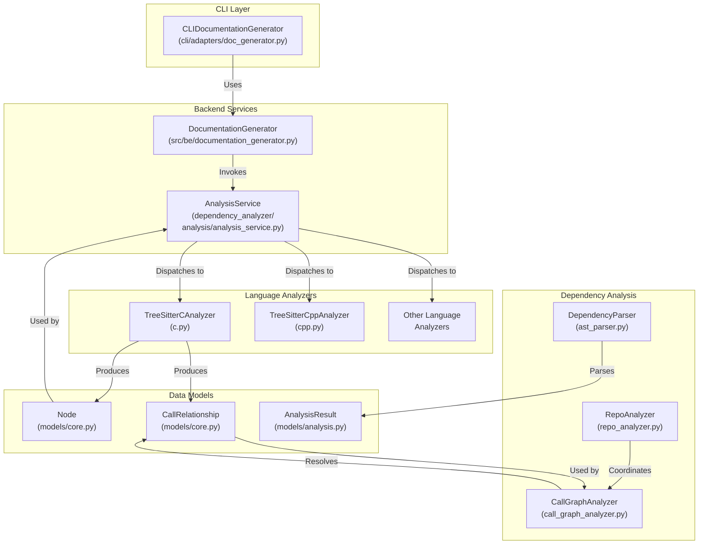
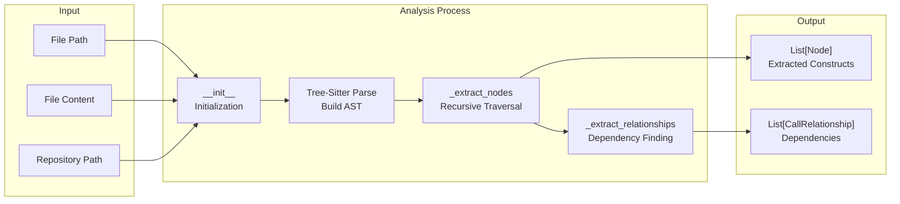
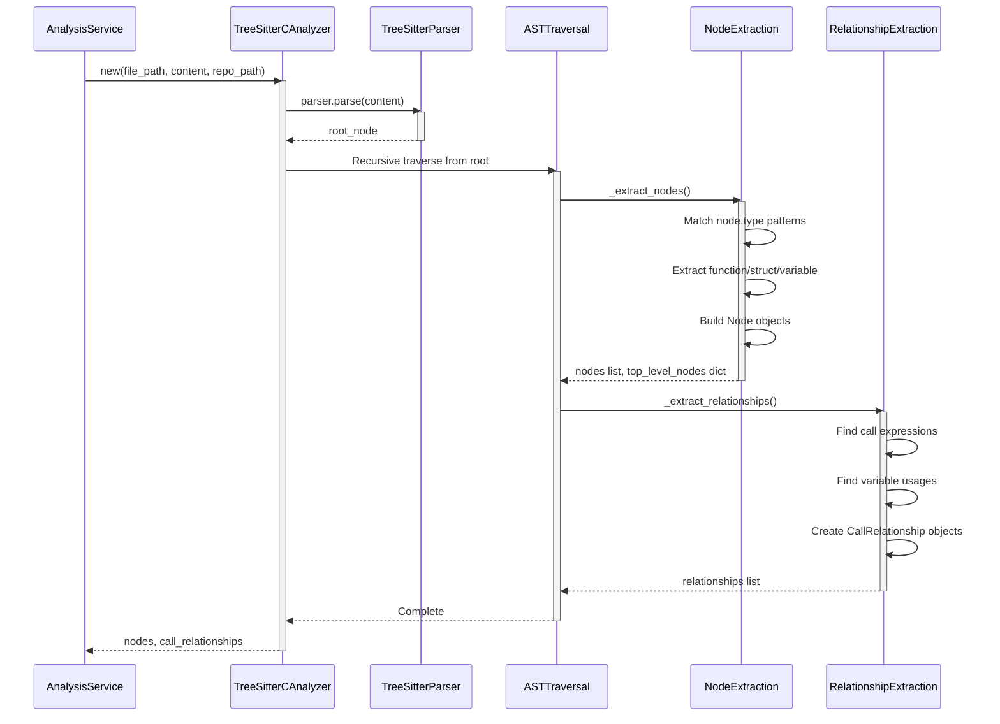

# C Analyzer Module Documentation

## Overview

The **c_analyzer** module is a specialized code analysis component for C language files within the CodeWiki dependency analysis system. It uses Tree-Sitter, a general-purpose incremental parsing library, to parse and extract structural information from C source code, including function definitions, struct declarations, global variables, and their relationships.

### Purpose

- **Parse C Code**: Uses Tree-Sitter to efficiently parse C syntax and build abstract syntax trees (ASTs)
- **Extract Constructs**: Identifies top-level C language constructs (functions, structs, global variables)
- **Build Dependency Graph**: Extracts relationships between identified constructs (function calls, variable usage)
- **Enable Documentation**: Provides the foundation for automated documentation generation by making code structure machine-readable

### Key Capabilities

- Recursive AST traversal for comprehensive node extraction
- Multi-type relationship detection (function calls, variable access)
- System function filtering to exclude standard library calls
- Cross-file relationship support for call graph construction
- Component ID generation for unique node identification

---

## Architecture

### System Integration



---

## Component Architecture

### TreeSitterCAnalyzer

The core component of the c_analyzer module, responsible for parsing individual C files and extracting their structural information.



---

## Data Flow

### File Analysis Pipeline



---

## Component Details

### TreeSitterCAnalyzer Class

**Location**: `codewiki/src/be/dependency_analyzer/analyzers/c.py`

#### Constructor

```python
def __init__(self, file_path: str, content: str, repo_path: str = None)
```

**Parameters**:
- `file_path` (str): Absolute or relative path to the C source file
- `content` (str): Complete file content as a string
- `repo_path` (str, optional): Root path of the repository for relative path calculation

**Initialization Flow**:
1. Stores file metadata (path, content, repo context)
2. Initializes empty lists for nodes and relationships
3. Triggers `_analyze()` to process the file

#### Key Methods

##### `_analyze()`
Main orchestration method that:
1. Creates Tree-Sitter parser with C language configuration
2. Parses file content into AST
3. Calls `_extract_nodes()` for initial node discovery
4. Calls `_extract_relationships()` to establish dependencies

##### `_extract_nodes(node, top_level_nodes, lines)`
**Recursion-based AST traversal** that:
- Identifies top-level C constructs by matching `node.type`:
  - `function_definition` → "function"
  - `struct_specifier` → "struct"
  - `type_definition` → "struct" (typedef)
  - `declaration` (global scope) → "variable"
- Extracts metadata: name, line numbers, source code snippet
- Creates `Node` objects for functions and structs
- Maintains `top_level_nodes` dictionary for fast lookup
- **Filters**: Only adds functions and structs to `self.nodes`; variables tracked for relationship analysis

**Node Type Matching Logic**:
```
function_definition
├─ function_declarator (contains function name)
│  └─ identifier (the function name)
└─ (function body)

struct_specifier
├─ type_identifier (struct name)
└─ (struct body)

type_definition (typedef struct)
├─ struct_specifier
└─ type_identifier (typedef name)

declaration (global variable)
└─ init_declarator or identifier
   └─ identifier (variable name)
```

##### `_extract_relationships(node, top_level_nodes)`
**Recursive relationship discovery** that identifies:

1. **Function Calls**: `call_expression` nodes
   - Finds containing function using `_find_containing_function()`
   - Extracts called function name from identifier
   - Filters system functions using `_is_system_function()`
   - Creates unresolved CallRelationship (cross-file resolution deferred)

2. **Global Variable Access**: `identifier` nodes in function scope
   - Checks if identifier refers to global variable
   - Creates resolved CallRelationship (local file)

**Filtering System Functions**:
Common C library functions are excluded:
- I/O: `printf`, `scanf`, `fopen`, `fclose`, `fread`, `fwrite`
- Memory: `malloc`, `free`, `memcpy`, `memset`
- String: `strlen`, `strcpy`, `strcmp`
- Process: `exit`, `abort`
- Graphics (SDL): `SDL_Init`, `SDL_CreateWindow`, etc.

##### `_find_containing_function(node, top_level_nodes)`
Walks up the AST parent chain to find the enclosing `function_definition` node.

##### Helper Methods

**`_get_module_path()`**: Generates module path from file path
- Converts absolute paths to repository-relative
- Removes file extensions (.c, .h)
- Converts path separators to dots for module notation
- Example: `src/utils/helpers.c` → `src.utils.helpers`

**`_get_relative_path()`**: Gets repository-relative file path

**`_get_component_id(name)`**: Generates unique component identifier
- Format: `relative/path/to/file.c::component_name`
- Example: `src/parser.c::parse_expression`

**`_is_global_variable(node)`**: Checks if declaration is at file scope
- Walks parent chain up AST
- Returns false if inside function or struct
- Returns true if reaches file root

**`_is_system_function(func_name)`**: Classifies function as system/library

---

## Data Models

### Node Class
**Source**: `codewiki/src/be/dependency_analyzer/models/core.py`

Represents a single code construct extracted from C source.

```python
@dataclass
class Node(BaseModel):
    id: str                          # Unique identifier
    name: str                        # Simple component name
    component_type: str              # "function", "struct", "variable"
    file_path: str                   # Absolute file path
    relative_path: str               # Repository-relative path
    source_code: Optional[str]       # Extracted source code snippet
    start_line: int                  # Starting line number (1-indexed)
    end_line: int                    # Ending line number (1-indexed)
    has_docstring: bool              # Always False for C (no docstrings)
    docstring: str                   # Empty for C
    parameters: Optional[List[str]]  # None for C (not extracted)
    node_type: Optional[str]         # "function", "struct", "variable"
    base_classes: Optional[List]     # None for C (no inheritance)
    class_name: Optional[str]        # None (not applicable to C)
    display_name: Optional[str]      # "function foo", "struct Bar"
    component_id: Optional[str]      # Duplicate of id field
```

### CallRelationship Class
**Source**: `codewiki/src/be/dependency_analyzer/models/core.py`

Represents a dependency between two code constructs.

```python
@dataclass
class CallRelationship(BaseModel):
    caller: str                    # Component ID of calling entity
    callee: str                    # Component ID or name of called entity
    call_line: Optional[int]       # Line number where call occurs
    is_resolved: bool              # Whether callee is a fully qualified ID
```

---

## Analysis Process

### 1. Node Extraction Phase

**Goal**: Identify all top-level C constructs

**Process**:
- Recursively traverse AST from root
- Match node types (function_definition, struct_specifier, etc.)
- Extract metadata (name, line numbers, source code)
- Create Node objects for functions and structs
- Store variables for relationship analysis

### 2. Relationship Extraction Phase

**Goal**: Identify dependencies between extracted nodes

**Relationship Types**:

| Type | Pattern | Example |
|------|---------|---------|
| Function Call | `call_expression` in function body | `parse_statement()` |
| Variable Usage | `identifier` (global var) in function | `global_config` |

---

## Integration Points

### With AnalysisService
The AnalysisService dispatches C files to TreeSitterCAnalyzer for analysis.

### With CallGraphAnalyzer
Processes unresolved relationships to build complete call graphs.

### With RepoAnalyzer
Orchestrates file-level analysis across the repository.

---

## Limitations & Considerations

### C Language Features Not Supported
1. **Macro Analysis**: Preprocessor directives not analyzed
2. **Type Inference**: Parameter and return types not extracted
3. **Struct/Union Members**: Internal structure not decomposed
4. **Pointer Resolution**: Function pointers and indirect calls not tracked
5. **Inline Assembly**: ASM blocks ignored

### Current Extraction Scope
- ✅ Top-level function definitions
- ✅ Struct/union definitions
- ✅ Global variable declarations
- ✅ Function-to-function calls
- ✅ Global variable usage
- ❌ Local variables
- ❌ Function parameters
- ❌ Return types

---

## Example Walkthrough

### Input C File

```c
#include <stdio.h>

int result = 0;

int add(int a, int b) {
    result = a + b;
    return result;
}

void print_result() {
    printf("Result: %d\n", result);
}

int main() {
    int sum = add(5, 3);
    print_result();
    return 0;
}
```

### Analysis Output

**Nodes Extracted** (3 functions found):
- `src/calculator.c::add`
- `src/calculator.c::print_result`
- `src/calculator.c::main`

**Relationships Extracted**:
- `add` → `result` (global variable usage, resolved)
- `main` → `add` (function call, unresolved)
- `main` → `print_result` (function call, unresolved)
- `printf` → **filtered** (system function)

---

## Related Modules

- **[language_analyzers](language_analyzers.md)**: Parent module containing all language-specific analyzers
- **[cpp_analyzer](cpp_analyzer.md)**: Similar C++ analyzer
- **[dependency_analysis_services](dependency_analysis_services.md)**: Services coordinating analyzer usage
- **[call_graph_analyzer](call_graph_analyzer.md)**: Processes and resolves call relationships
- **[dependency_analyzer_models](dependency_analyzer_models.md)**: Data models (Node, CallRelationship, AnalysisResult)

---

## Usage Guide

### Basic File Analysis

```python
from codewiki.src.be.dependency_analyzer.analyzers.c import TreeSitterCAnalyzer

# Read and analyze C file
with open("src/parser.c", "r") as f:
    content = f.read()

analyzer = TreeSitterCAnalyzer(
    file_path="src/parser.c",
    content=content,
    repo_path="/home/user/project"
)

# Access results
for node in analyzer.nodes:
    print(f"{node.display_name} at line {node.start_line}")

for rel in analyzer.call_relationships:
    print(f"{rel.caller} → {rel.callee}")
```

---

## Performance Considerations

- **Incremental Parsing**: Tree-Sitter supports incremental updates for faster re-analysis
- **Single-Pass Extraction**: Node and relationship extraction in one traversal
- **Memory Usage**: Suitable for files <1MB

---

## Version Information

- **Analyzer Framework**: Tree-Sitter v0.20+
- **Language Binding**: `tree_sitter_c` Python binding
- **C Standard**: C99 and later
- **Last Updated**: 2024
