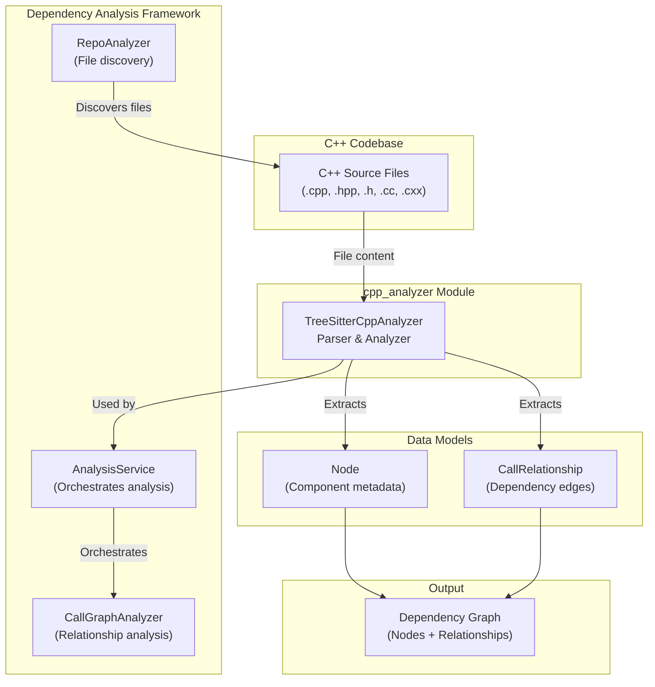
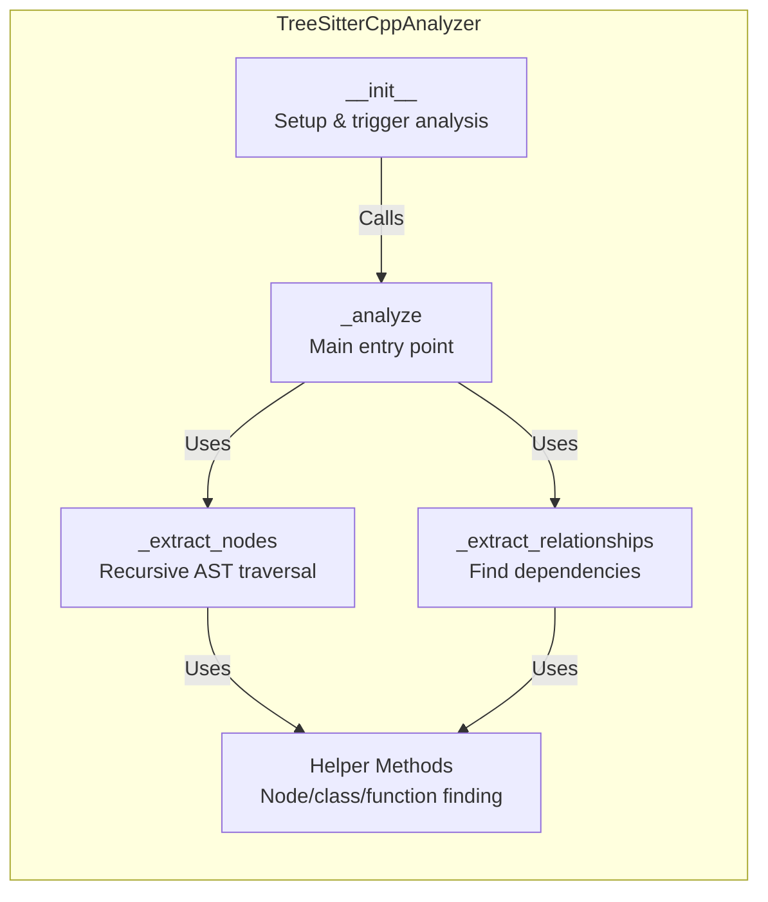
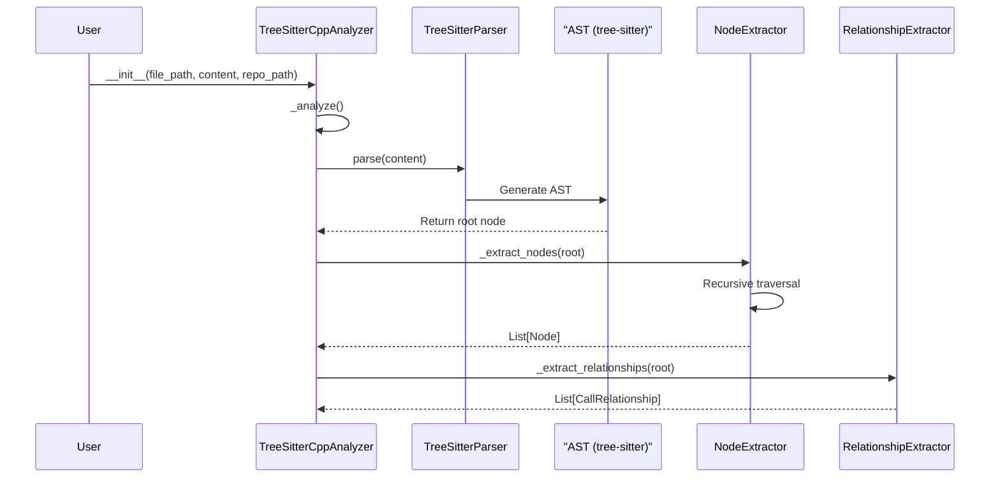
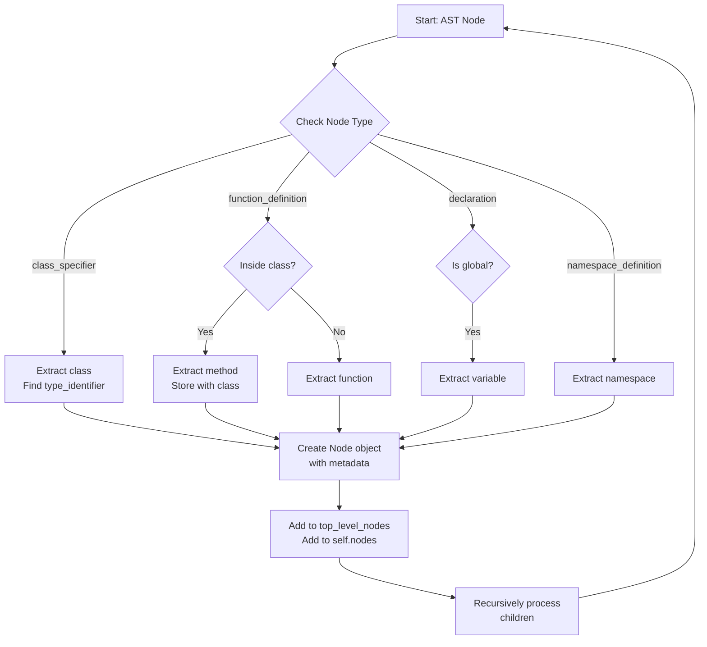
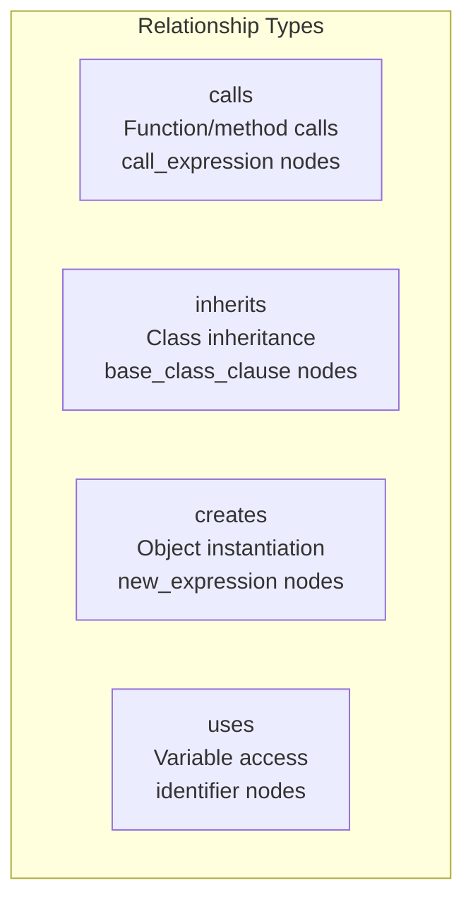
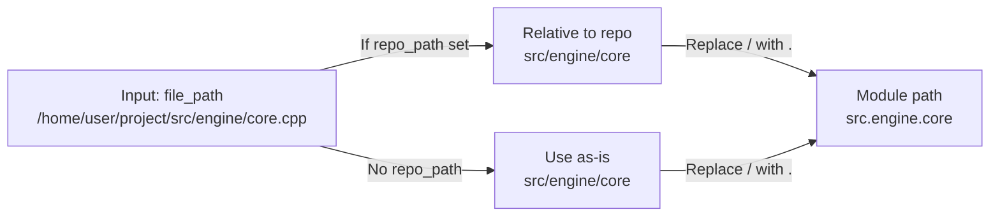
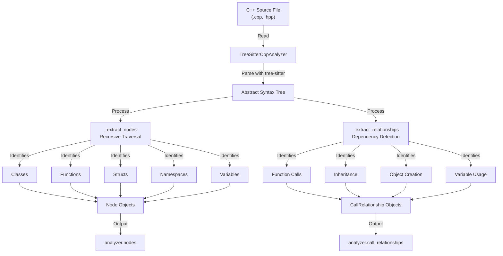
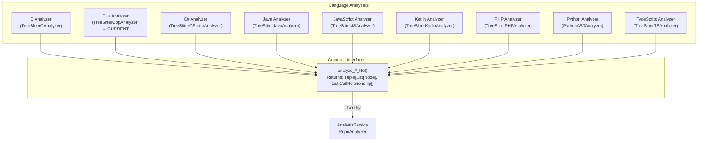

# C++ Analyzer Module Documentation

## Module Overview

The **cpp_analyzer** module is a specialized language analyzer that parses C++ source files and extracts code structure information including components (classes, functions, structs, namespaces, variables) and their relationships (method calls, inheritance, object creation, variable usage).

### Purpose
- **Primary Goal**: Extract semantic and structural information from C++ source code files
- **Technology**: Uses tree-sitter-cpp parser for accurate AST (Abstract Syntax Tree) analysis
- **Role in System**: Part of the language-agnostic dependency analysis framework, enabling CodeWiki to understand C++ codebases

### Key Responsibilities
1. Parse C++ source code into Abstract Syntax Trees (AST)
2. Extract top-level code components (classes, functions, structs, namespaces, variables)
3. Identify relationships between components (calls, inheritance, instantiation, variable usage)
4. Generate normalized component identifiers and metadata

---

## Architecture Overview

### System Context



### Module Components



---

## Component Details

### TreeSitterCppAnalyzer Class

The main analyzer class responsible for parsing C++ code and extracting structural information.

#### Attributes
| Attribute | Type | Purpose |
|-----------|------|---------|
| `file_path` | `Path` | Full path to the C++ source file |
| `content` | `str` | Raw text content of the C++ file |
| `repo_path` | `str` | Repository root path (optional) |
| `nodes` | `List[Node]` | Extracted code components |
| `call_relationships` | `List[CallRelationship]` | Extracted relationships between components |

#### Core Processing Pipeline



---

## Detailed Method Documentation

### Initialization & Analysis

#### `__init__(file_path, content, repo_path=None)`
Initializes the analyzer and triggers the analysis pipeline.

**Parameters:**
- `file_path` (str): Path to the C++ source file
- `content` (str): Raw source code content
- `repo_path` (str, optional): Repository root path for relative path calculation

**Flow:**
1. Store file metadata (path, content, repo)
2. Initialize empty node and relationship collections
3. Call `_analyze()` to start processing

#### `_analyze()`
Main entry point for AST processing.

**Steps:**
1. Initialize tree-sitter C++ language and parser
2. Parse source code into AST
3. Split content into lines for source code extraction
4. Call `_extract_nodes()` to find all components
5. Call `_extract_relationships()` to find dependencies

---

### Node Extraction

#### `_extract_nodes(node, top_level_nodes, lines)`
Recursively traverses the AST to extract code components.

**Supported Node Types:**
| Node Type | AST Type | Description |
|-----------|----------|-------------|
| **class** | `class_specifier` | Class definitions |
| **struct** | `struct_specifier` | Struct definitions |
| **function** | `function_definition` (top-level) | Global functions |
| **method** | `function_definition` (inside class) | Class member functions |
| **namespace** | `namespace_definition` | Namespace declarations |
| **variable** | `declaration` (global) | Global variables |

**Process:**


**Generated Node Object:**
```python
Node(
    id: str,                    # Unique component identifier
    name: str,                  # Component name
    component_type: str,        # 'class', 'struct', 'function', 'method', 'variable', 'namespace'
    file_path: str,             # Full file path
    relative_path: str,         # Relative to repo root
    source_code: str,           # Code snippet
    start_line: int,            # 1-indexed line number
    end_line: int,              # 1-indexed line number
    has_docstring: bool,        # Always False for C++ (no docstring support)
    parameters: None,           # Not yet implemented
    class_name: str,            # For methods, parent class name
    display_name: str           # Human-readable label
)
```

#### Helper Methods for Node Extraction

**`_get_component_id(name, parent_class=None) -> str`**
- Generates unique identifier for a component
- Format: `relative_path::component_name` (for functions/variables)
- Format: `relative_path::ClassName.method_name` (for methods)
- Example: `src/core.cpp::MyClass.processData`

**`_is_global_variable(node) -> bool`**
- Determines if a declaration is at global scope
- Checks if node is NOT inside function, class, or struct

**`_find_containing_class_for_method(node) -> Optional[str]`**
- Walks up AST to find parent class/struct
- Returns class name or None if top-level function

---

### Relationship Extraction

#### `_extract_relationships(node, top_level_nodes)`
Identifies dependencies and relationships between components.

**Supported Relationship Types:**



#### Detailed Relationship Extraction Logic

**1. Call Relationships (`call_expression`)**
```
Detects function/method calls
- Finds containing function/method context
- Identifies called function name
- Filters out system functions (printf, cout, etc.)
- Creates CallRelationship(caller, callee, 'calls')
```

Example Detection:
```cpp
void Process::run() {          // containing_function = "run"
    helper();                   // Called function = "helper"
    std::cout << "msg";         // Filtered (system function)
}
```

**2. Inheritance Relationships (`base_class_clause`)**
```
Detects class inheritance
- Finds containing class
- Extracts base class names
- Creates CallRelationship(child_class, base_class, 'inherits')
```

Example Detection:
```cpp
class Derived : public Base {  // caller = "Derived", callee = "Base"
};
```

**3. Object Creation (`new_expression`)**
```
Detects dynamic object instantiation
- Finds containing function context
- Extracts instantiated class name
- Creates CallRelationship(creator_func, created_class, 'creates')
```

Example Detection:
```cpp
void Manager::init() {         // containing_function = "init"
    Worker* w = new Worker();   // created class = "Worker"
}
```

**4. Variable Usage (`identifier`)**
```
Detects global variable access
- Checks if identifier refers to global variable
- Finds containing function context
- Creates CallRelationship(func, variable, 'uses')
```

Example Detection:
```cpp
int globalCounter;             // defined variable

void Process::tick() {         // containing_function = "tick"
    globalCounter++;            // uses globalCounter
}
```

#### Helper Methods for Relationship Extraction

**`_find_containing_function_or_method(node, top_level_nodes) -> Optional[str]`**
- Traverses AST upward to find enclosing function
- Returns function name or None

**`_find_containing_class(node) -> Optional[str]`**
- Walks up AST to find parent class/struct
- Used for inheritance relationship detection

**`_is_system_function(func_name) -> bool`**
- Filters out C++ standard library functions
- Predefined list: printf, scanf, malloc, free, strlen, cout, cin, etc.
- Prevents noise in dependency graph

**`_class_has_method(class_node, method_name) -> bool`**
- Simple heuristic to verify method exists in class
- Checks source code lines for method signature patterns

---

## Path & Identifier Resolution

### Module Path Construction



**Methods:**
- `_get_module_path()`: Returns dot-separated module path
- `_get_relative_path()`: Returns OS-independent relative path
- `_get_component_id()`: Creates unique component identifiers

**Examples:**
```
File: /repo/src/engine/core.cpp
- _get_module_path() → "src.engine.core"
- _get_relative_path() → "src/engine/core.cpp"
- _get_component_id("process") → "src/engine/core.cpp::process"
- _get_component_id("process", "Engine") → "src/engine/core.cpp::Engine.process"
```

---

## Data Flow Diagram



---

## Integration with Larger System

### Dependencies

The cpp_analyzer module depends on:

1. **Models** ([dependency_analyzer_models.md](dependency_analyzer_models.md))
   - `Node`: Represents extracted code components
   - `CallRelationship`: Represents dependencies between components

2. **External Libraries**
   - `tree-sitter`: Core parsing library
   - `tree-sitter-cpp`: C++ language bindings

### Consumers

The cpp_analyzer is used by:

1. **AnalysisService** ([dependency_analysis_services.md](dependency_analysis_services.md))
   - Orchestrates analysis across multiple language analyzers
   - Aggregates results from all language-specific analyzers

2. **RepoAnalyzer** ([dependency_analysis_services.md](dependency_analysis_services.md))
   - Discovers C++ files in repository
   - Invokes TreeSitterCppAnalyzer for each file

3. **CallGraphAnalyzer** ([dependency_analysis_services.md](dependency_analysis_services.md))
   - Processes extracted relationships
   - Builds complete call graph

### Language Analyzer Family



---

## Usage Example

### Basic Analysis

```python
from codewiki.src.be.dependency_analyzer.analyzers.cpp import TreeSitterCppAnalyzer

# Load C++ file
with open("src/engine.cpp", "r") as f:
    content = f.read()

# Create analyzer
analyzer = TreeSitterCppAnalyzer(
    file_path="src/engine.cpp",
    content=content,
    repo_path="/home/user/project"
)

# Access results
print(f"Found {len(analyzer.nodes)} components")
print(f"Found {len(analyzer.call_relationships)} relationships")

# Inspect extracted nodes
for node in analyzer.nodes:
    print(f"- {node.component_type}: {node.name} ({node.id})")

# Inspect extracted relationships
for rel in analyzer.call_relationships:
    print(f"  {rel.caller} -> {rel.callee} ({rel.relationship_type})")
```

### Using the Module-Level Function

```python
from codewiki.src.be.dependency_analyzer.analyzers.cpp import analyze_cpp_file

nodes, relationships = analyze_cpp_file(
    file_path="src/core.cpp",
    content=cpp_content,
    repo_path="/repo"
)
```

---

## Limitations & Considerations

### Current Limitations

1. **Docstrings**: C++ doesn't have docstrings like Python, so `has_docstring` is always False
2. **Parameter Extraction**: Not yet implemented; `parameters` is always None
3. **Method Resolution**: Simple heuristic-based method detection in classes
4. **Namespace Tracking**: Partial support; doesn't fully track qualified names
5. **Macro Expansion**: Cannot resolve preprocessor macros
6. **Template Specialization**: Template-based relationships not tracked

### Known Edge Cases

1. **Anonymous Functions/Classes**: May not be properly extracted
2. **Header-Only Libraries**: Definitions in .hpp files are extracted but may miss templates
3. **PIMPL Pattern**: Opaque pointer usage not detected as relationship
4. **Operator Overloading**: May be detected as regular function calls
5. **Inline Definitions**: Extracted correctly but sometimes classified as methods/functions inconsistently

### Performance Considerations

- **AST Parsing**: Linear time relative to file size
- **Recursive Traversal**: O(n) for AST nodes
- **Helper Lookups**: O(n) for class/function finding (could be optimized with symbol table)
- **Large Files**: May be slow for files > 50KB with deep nesting

---

## Related Modules

- **[dependency_analyzer_models.md](dependency_analyzer_models.md)**: Core data models (Node, CallRelationship)
- **[dependency_analysis_services.md](dependency_analysis_services.md)**: Analysis orchestration and graph building
- **[c_analyzer.md](c_analyzer.md)**: Sibling C language analyzer
- **[language_analyzers.md](language_analyzers.md)**: Overview of all language-specific analyzers

---

## Extension Points

To add new C++ analysis capabilities:

1. **Add new node types**: Extend `_extract_nodes()` with additional AST node type checks
2. **Add new relationships**: Add cases to `_extract_relationships()` method
3. **Filter system functions**: Update `_is_system_function()` predefined list
4. **Extract metadata**: Enhance `Node` object with additional fields (e.g., access modifiers, const-correctness)

Example extension for extracting templates:
```python
elif node.type == "template_declaration":
    # Extract template parameters
    # Handle template specializations
    pass
```

---

## Version History

| Version | Date | Changes |
|---------|------|---------|
| 1.0.0 | Current | Initial implementation with class, struct, function, method, variable, and namespace extraction |

---

## References

- **Tree-Sitter C++ Grammar**: https://github.com/tree-sitter/tree-sitter-cpp
- **AST Node Types**: https://tree-sitter.github.io/tree-sitter/syntax-highlighting
- **C++ Standard**: ISO/IEC 14882:2020 (C++20)
