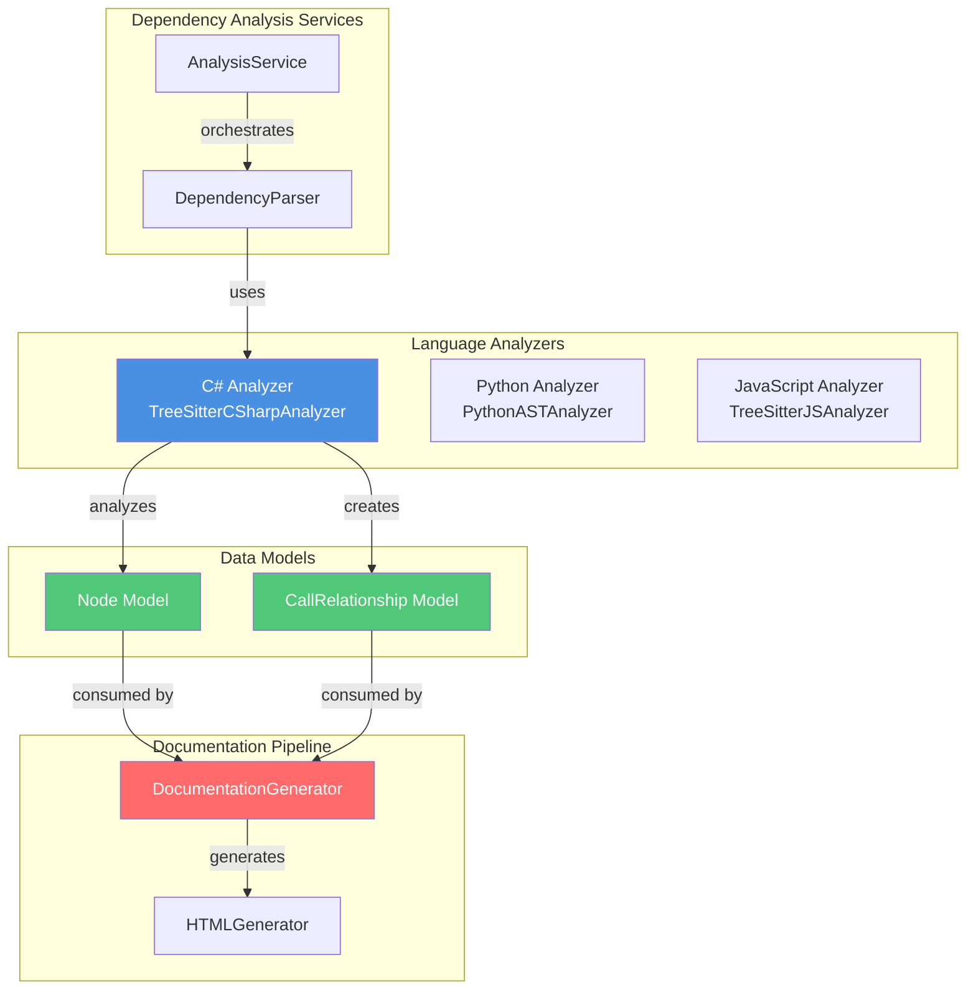
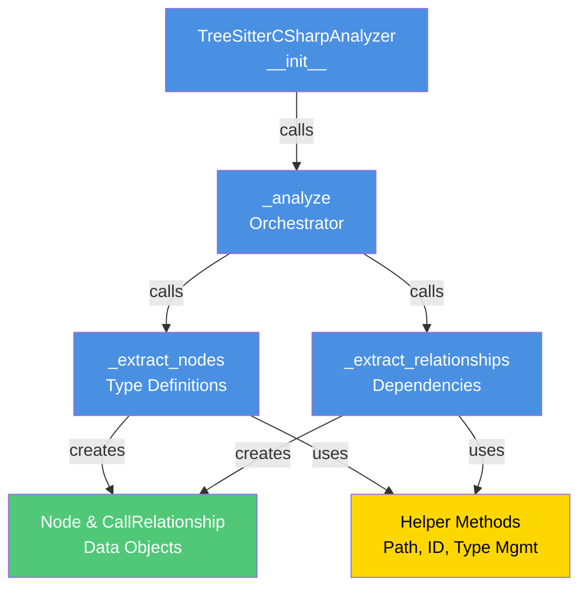
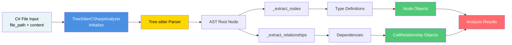
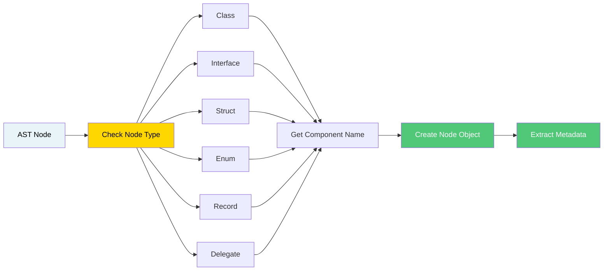
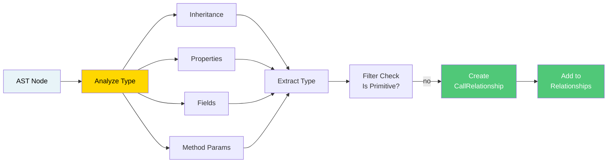
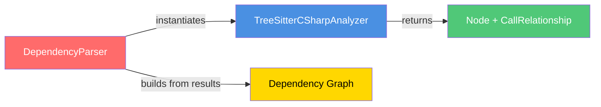

# C# Analyzer Module Documentation

## Overview

The **csharp_analyzer** module is a language-specific analyzer responsible for parsing and extracting code components and their relationships from C# source files. It is part of the larger CodeWiki dependency analysis system and enables automated documentation generation by understanding C# code structure, class hierarchies, and component dependencies.

### Module Purpose

- **Parse C# syntax trees** using Tree-sitter parser to identify code components
- **Extract type definitions** including classes, interfaces, structs, enums, records, and delegates
- **Analyze dependencies** between components based on inheritance, field types, property types, and method parameters
- **Generate component metadata** for documentation and visualization
- **Support repository-wide analysis** by processing multiple C# files consistently

---

## Architecture

### System Context Diagram



### Component Architecture



---

## Core Components

### 1. TreeSitterCSharpAnalyzer

**Purpose**: Main analyzer class that parses C# files and extracts code components and relationships.

**Key Attributes**:
- `file_path` (Path): Path to the C# file being analyzed
- `content` (str): Raw content of the C# file
- `repo_path` (str): Repository root path for relative path calculation
- `nodes` (List[Node]): Extracted code components
- `call_relationships` (List[CallRelationship]): Dependencies between components

**Key Methods**:

#### `__init__(file_path, content, repo_path=None)`
Initializes the analyzer and triggers analysis.

#### `_analyze()`
Main orchestrator method that:
1. Creates a Tree-sitter parser with C# language support
2. Parses the file content into an AST
3. Extracts top-level nodes (type definitions)
4. Extracts relationships between nodes

#### `_extract_nodes(node, top_level_nodes, lines)`
Recursively traverses the AST and extracts type definitions:
- **Class declarations** (including abstract and static variants)
- **Interface declarations**
- **Struct declarations**
- **Enum declarations**
- **Record declarations**
- **Delegate declarations**

Each extracted node is represented as a `Node` object with metadata including:
- Component ID (file::typename)
- Display name and type
- Source code snippet
- Line number range
- Docstring information

#### `_extract_relationships(node, top_level_nodes)`
Recursively analyzes AST nodes to identify dependencies:

**Inheritance relationships**:
- Extracts base class/interface from `base_list` nodes
- Creates CallRelationship with `is_resolved=True`

**Type dependencies**:
- **Properties**: Analyzes property types
- **Fields**: Analyzes field types  
- **Method parameters**: Analyzes parameter types

Dependencies are marked as `is_resolved=False` unless the type is a known top-level class.

#### `_is_primitive_type(type_name)`
Filters out C# primitive and common built-in types:
- Primitives: `bool`, `byte`, `int`, `long`, `string`, `object`, etc.
- Built-in types: `List`, `Dictionary`, `Task`, `DateTime`, etc.

This prevents unnecessary dependency tracking for system types.

#### `_find_containing_class(node, top_level_nodes)`
Traverses parent nodes to find the class/struct that contains a given AST node, enabling proper relationship attribution.

#### `_get_component_id(name)`
Generates unique component identifiers in the format: `relative_path::component_name`

#### `_get_module_path()`
Converts file path to module path by removing file extension and replacing separators with dots.

---

## Data Flow

### Analysis Pipeline



### Type Definition Extraction Process



### Relationship Extraction Process



---

## Key Features

### 1. Tree-Sitter Based Parsing

Uses the **tree-sitter** library with C# grammar for robust, incremental parsing that handles:
- Complex syntax structures
- Malformed code gracefully
- Large files efficiently

### 2. Multi-Type Support

Analyzes various C# type definitions:
- Classes (including abstract and static variants)
- Interfaces
- Structs
- Enums
- Records (C# 9+)
- Delegates

### 3. Comprehensive Dependency Tracking

Captures dependencies from:
- **Class inheritance** (base classes and interfaces)
- **Property types** used in class definitions
- **Field types** used in class definitions
- **Method parameter types**

### 4. Type Filtering

Intelligently filters out built-in and primitive types to focus on meaningful domain dependencies:
- C# primitives (bool, int, string, etc.)
- Framework types (List, Dictionary, Task, DateTime, etc.)
- Only tracks custom domain types

### 5. Path Management

Handles path conversions for consistent identification:
- Absolute to relative path conversion
- File-to-module path transformation
- Cross-platform path separator handling

### 6. Metadata Extraction

For each component, captures:
- Unique component ID
- Component name and type
- Full source code
- Line number range
- Documentation/docstring information

---

## Integration Points

### 1. With DependencyParser



The `DependencyParser` orchestrates the analyzer to process all C# files in a repository and constructs a complete dependency graph.

**Integration Details**:
- Called for each `.cs` file found during repository scanning
- Results aggregated with other language analyzers
- File path and content provided by parser
- Nodes and relationships collected into unified component model

### 2. With AnalysisService

The `AnalysisService` (see [dependency_analysis_services.md](dependency_analysis_services.md)) coordinates:
- Repository structure analysis
- Multi-language file discovery
- Parallel analysis of components
- Call graph construction

### 3. With Node & CallRelationship Models

**Node Model** captures component metadata:
```python
Node(
    id="MyFile.cs::MyClass",
    name="MyClass",
    component_type="class",
    file_path="/path/to/MyFile.cs",
    relative_path="MyFile.cs",
    source_code="public class MyClass { ... }",
    start_line=5,
    end_line=25,
    display_name="class MyClass",
    base_classes=["BaseClass"],  # Inheritance
    # ... other metadata
)
```

**CallRelationship Model** represents dependencies:
```python
CallRelationship(
    caller="MyFile.cs::MyClass",
    callee="MyFile.cs::IDependency",
    call_line=10,
    is_resolved=True  # Known type vs external
)
```

See [dependency_analyzer_models.md](dependency_analyzer_models.md) for detailed model documentation.

### 4. With DocumentationGenerator

Output from C# analyzer feeds into documentation pipeline:


See [documentation_generation.md](documentation_generation.md) for details on how analysis results are used to generate documentation.

---

## Usage

### Direct Usage

```python
from codewiki.src.be.dependency_analyzer.analyzers.csharp import analyze_csharp_file

# Analyze a single C# file
content = open("MyClass.cs").read()
nodes, relationships = analyze_csharp_file(
    file_path="src/MyClass.cs",
    content=content,
    repo_path="/path/to/repo"
)

# Process results
for node in nodes:
    print(f"Found: {node.display_name} at line {node.start_line}")

for rel in relationships:
    print(f"Dependency: {rel.caller} -> {rel.callee}")
```

### Integration with DependencyParser

```python
from codewiki.src.be.dependency_analyzer.ast_parser import DependencyParser

parser = DependencyParser(repo_path="/path/to/csharp/repo")
components = parser.parse_repository()  # Automatically uses C# analyzer

# Results include all C#-specific types and relationships
for component_id, node in components.items():
    if "class" in node.component_type:
        print(f"Class: {node.name} inherits from {node.base_classes}")
```

---

## Design Patterns

### 1. Recursive Tree Traversal

Both `_extract_nodes` and `_extract_relationships` use recursive traversal of the AST:

```python
def _extract_nodes(self, node, top_level_nodes, lines):
    # Process current node
    if node.type == "class_declaration":
        # Extract this node
        ...
    
    # Recursively process children
    for child in node.children:
        self._extract_nodes(child, top_level_nodes, lines)
```

This pattern ensures all components at any nesting level are captured.

### 2. Type Filtering

Primitive type check centralizes filtering logic:

```python
def _is_primitive_type(self, type_name: str) -> bool:
    primitives = {
        "bool", "byte", "int", ..., "Task", "List", ...
    }
    return type_name in primitives
```

Enables consistent filtering across all relationship extraction methods.

### 3. Path Management

Separates concerns of absolute and relative path handling:
- `_get_module_path()`: File to module path conversion
- `_get_relative_path()`: Absolute to relative conversion
- `_get_component_id()`: Generates formatted component identifiers

### 4. Keyword-Based Node Identification

For C# declarations, finds the keyword then the identifier:

```python
def _get_identifier_name_cs(self, node):
    if node.type == "class_declaration":
        found_class_keyword = False
        for child in node.children:
            if child.type == "class":
                found_class_keyword = True
            elif found_class_keyword and child.type == "identifier":
                return child.text.decode()
```

Handles variations in AST structure robustly.

---

## Error Handling & Robustness

### Parser Resilience

The analyzer handles:
- **Incomplete/malformed C# code**: Tree-sitter continues parsing despite syntax errors
- **Missing components**: Optional node searches return None instead of raising
- **Path normalization**: Cross-platform path separator handling

### Logging

Uses Python's logging module for diagnostic information:
```python
logger.debug(f"Found node: {node_name}")
logger.warning(f"Unknown node type: {node_type}")
```

### Dependency Validation

Relationships marked with `is_resolved` flag:
- `True`: Callee is a known top-level component in same file
- `False`: Callee is external dependency or unresolved type

---

## Performance Characteristics

### Time Complexity

- **File parsing**: O(n) where n = file size
- **Node extraction**: O(m) where m = number of AST nodes
- **Relationship extraction**: O(m × k) where k = average node children

Overall: **O(n)** per file - linear in file size

### Space Complexity

- **AST memory**: O(n) to store parsed tree
- **Nodes & relationships**: O(c + r) where c = components, r = relationships

---

## Comparison with Other Language Analyzers

| Feature | C# Analyzer | Python Analyzer | JavaScript Analyzer |
|---------|------------|-----------------|-------------------|
| **Parser** | Tree-sitter | Python AST | Tree-sitter |
| **Type Support** | Classes, Interfaces, Structs, Enums, Records, Delegates | Classes, Functions | Classes, Functions, Interfaces (TS) |
| **Inheritance** | ✓ (base_list) | ✓ (bases) | ✓ (class_name) |
| **Field Types** | ✓ | - | ✓ |
| **Property Types** | ✓ | - | ✓ |
| **Method Params** | ✓ | - | ✓ |
| **Call Tracking** | - | ✓ | ✓ |

Key distinction: C# analyzer focuses on **type structure and inheritance**, while Python analyzer emphasizes **function calls and dependencies**.

---

## Dependencies

### External Libraries

- **tree-sitter** (>= 0.20): Core parsing engine
- **tree-sitter-c-sharp** (>=X.Y.Z): C# language grammar

### Internal Dependencies

- **models.core**: `Node`, `CallRelationship` data models
- **dependency_analyzer**: Parent package for repository-wide analysis

---

## Future Enhancements

### Potential Improvements

1. **Generic Type Support**: Better handling of `List<T>`, `Dictionary<K,V>` patterns
2. **Method Call Tracking**: Analyze method calls within class bodies
3. **Namespace Resolution**: Track cross-namespace dependencies
4. **Attribute Extraction**: Capture C# attributes and annotations
5. **Interface Implementation**: Explicitly track interface implementations
6. **Extension Methods**: Recognize and track extension method dependencies
7. **Async/Await Analysis**: Track async method relationships
8. **Using Directive Analysis**: Extract namespace-level dependencies

### Scalability

For very large C# projects:
- Consider parallel file processing
- Implement streaming analysis for large files
- Add caching of parsing results

---

## Related Documentation

- [language_analyzers.md](language_analyzers.md) - Overview of all language analyzers
- [dependency_analysis_services.md](dependency_analysis_services.md) - Service orchestration layer
- [dependency_analyzer_models.md](dependency_analyzer_models.md) - Node and CallRelationship models
- [documentation_generation.md](documentation_generation.md) - How analysis results are used
- [dependency_analyzer.md](dependency_analyzer.md) - High-level dependency analysis module

---

## File Reference

**Location**: `codewiki/src/be/dependency_analyzer/analyzers/csharp.py`

**Primary Export**: `TreeSitterCSharpAnalyzer` class

**Helper Function**: `analyze_csharp_file(file_path, content, repo_path) -> Tuple[List[Node], List[CallRelationship]]`

---

## Version History

- **v1.0**: Initial implementation with support for classes, interfaces, structs, enums, records, delegates
- **v1.1**: Added property and field type dependency tracking
- **v1.2**: Improved method parameter dependency extraction
- **v1.3**: Enhanced primitive type filtering with expanded built-in types list
