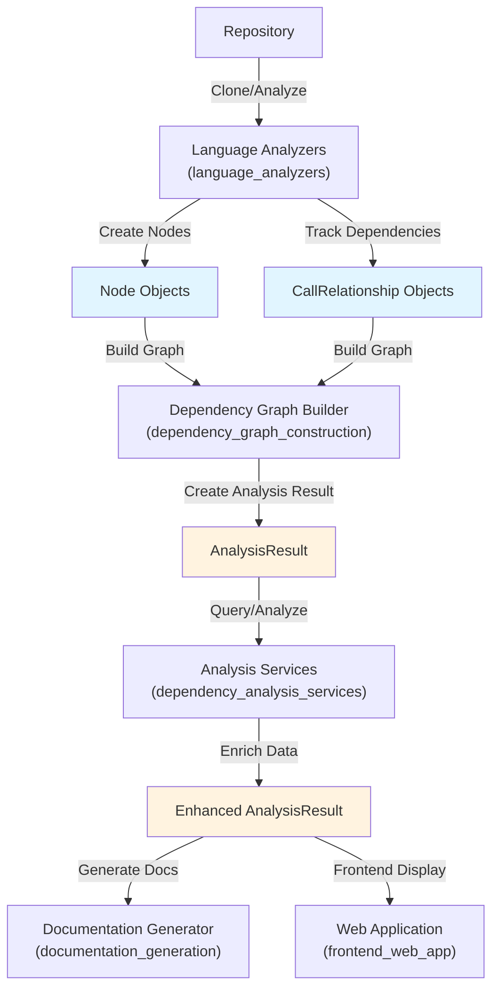
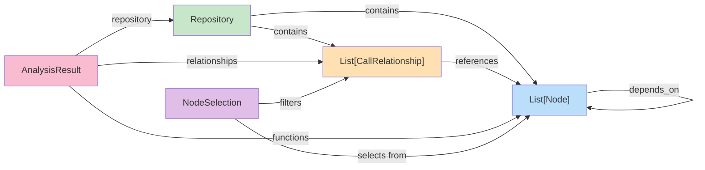
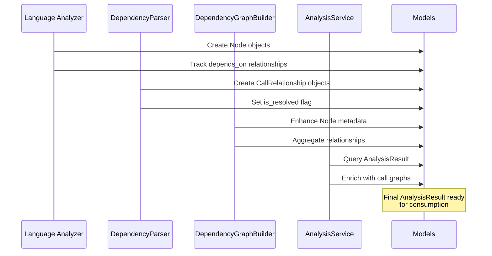
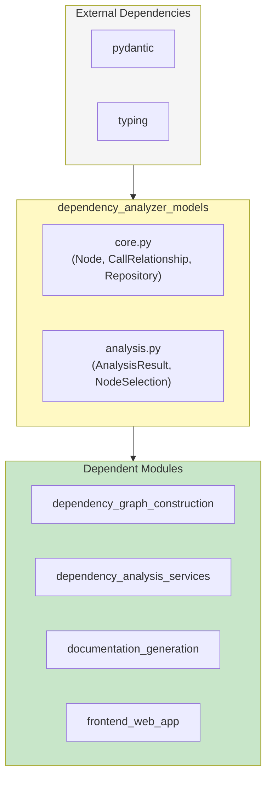

# Dependency Analyzer Models Module

## Overview

The `dependency_analyzer_models` module defines the core data structures and models used throughout the dependency analysis pipeline. It provides a unified representation for analyzing code repositories, tracking dependencies, and representing code components in a language-agnostic way.

This module serves as the **data contract layer** between the dependency analysis services and the rest of the codebase, ensuring consistent representation of code structures across different programming languages and analysis stages.

## Module Purpose

The module provides foundational Pydantic models that:
- Represent code entities (functions, classes, methods) as standardized `Node` objects
- Track dependencies and call relationships between code components
- Encapsulate repository metadata and analysis context
- Capture analysis results with comprehensive metadata
- Enable selective export and filtering of analysis data

## Core Components

### 1. Node

**File**: `codewiki/src/be/dependency_analyzer/models/core.py`

**Purpose**: Represents a single code component (function, class, method, etc.) in a language-agnostic way.

**Key Attributes**:

| Attribute | Type | Purpose |
|-----------|------|---------|
| `id` | `str` | Unique identifier for the node |
| `name` | `str` | Name of the code component |
| `component_type` | `str` | Type of component (e.g., "function", "class", "method") |
| `file_path` | `str` | Absolute file path |
| `relative_path` | `str` | Relative path from repository root |
| `depends_on` | `Set[str]` | Set of node IDs this component depends on |
| `source_code` | `Optional[str]` | Original source code snippet |
| `start_line` | `int` | Starting line number in source file |
| `end_line` | `int` | Ending line number in source file |
| `has_docstring` | `bool` | Whether component has documentation |
| `docstring` | `str` | Documentation text |
| `parameters` | `Optional[List[str]]` | Function/method parameter names |
| `node_type` | `Optional[str]` | Specific node type (e.g., "function_def", "class_def") |
| `base_classes` | `Optional[List[str]]` | Parent classes (for class components) |
| `class_name` | `Optional[str]` | Containing class name (for methods) |
| `display_name` | `Optional[str]` | Human-readable display name |
| `component_id` | `Optional[str]` | Alternative component identifier |

**Methods**:

```python
def get_display_name(self) -> str
    """Returns display_name if available, otherwise returns name"""
```

**Usage Context**: Nodes are created by language analyzers ([language_analyzers](language_analyzers.md)) and consumed by the analysis services ([dependency_analysis_services](dependency_analysis_services.md)).

---

### 2. CallRelationship

**File**: `codewiki/src/be/dependency_analyzer/models/core.py`

**Purpose**: Represents a dependency or call relationship between two code components.

**Key Attributes**:

| Attribute | Type | Purpose |
|-----------|------|---------|
| `caller` | `str` | Node ID of the calling component |
| `callee` | `str` | Node ID of the called component |
| `call_line` | `Optional[int]` | Line number where call occurs |
| `is_resolved` | `bool` | Whether the relationship has been resolved to actual nodes |

**Semantics**: 
- Represents directed edges in the dependency graph
- `caller` → `callee` indicates a dependency relationship
- Used to construct the call graph and dependency network

**Usage Context**: Relationships are created during parsing ([dependency_graph_construction](dependency_graph_construction.md)) and analyzed by call graph analyzers.

---

### 3. Repository

**File**: `codewiki/src/be/dependency_analyzer/models/core.py`

**Purpose**: Encapsulates metadata about the analyzed repository.

**Key Attributes**:

| Attribute | Type | Purpose |
|-----------|------|---------|
| `url` | `str` | Repository URL (git remote) |
| `name` | `str` | Repository name |
| `clone_path` | `str` | Local filesystem path where repo is cloned |
| `analysis_id` | `str` | Unique identifier for this analysis run |

**Usage Context**: Embedded in `AnalysisResult` to provide context for analysis outputs.

---

### 4. AnalysisResult

**File**: `codewiki/src/be/dependency_analyzer/models/analysis.py`

**Purpose**: Comprehensive result object containing all outputs from a repository analysis.

**Key Attributes**:

| Attribute | Type | Purpose |
|-----------|------|---------|
| `repository` | `Repository` | Repository metadata |
| `functions` | `List[Node]` | All discovered nodes (functions, classes, etc.) |
| `relationships` | `List[CallRelationship]` | All discovered dependencies |
| `file_tree` | `Dict[str, Any]` | Hierarchical file structure representation |
| `summary` | `Dict[str, Any]` | Analysis statistics and summary data |
| `visualization` | `Dict[str, Any]` | Pre-computed visualization data (graphs, layouts) |
| `readme_content` | `Optional[str]` | Repository README content (if available) |

**Usage Context**: 
- Final output from the analysis pipeline ([dependency_analysis_services](dependency_analysis_services.md))
- Consumed by documentation generators ([documentation_generation](documentation_generation.md))
- Returned to frontend ([frontend_web_app](frontend_web_app.md))

---

### 5. NodeSelection

**File**: `codewiki/src/be/dependency_analyzer/models/analysis.py`

**Purpose**: Enables selective filtering and export of analysis results.

**Key Attributes**:

| Attribute | Type | Purpose |
|-----------|------|---------|
| `selected_nodes` | `List[str]` | Node IDs to include in export |
| `include_relationships` | `bool` | Whether to include dependencies |
| `custom_names` | `Dict[str, str]` | Custom display names for nodes |

**Usage Context**: Used for partial exports and customized documentation generation.

---

## Architecture & Data Flow

### Overall Pipeline



### Data Structure Relationships



### Component Life Cycle



---

## Integration Points

### Upstream Dependencies

**Language Analyzers** → Creates raw `Node` and `CallRelationship` objects
- [TreeSitterCAnalyzer](language_analyzers.md#c-analyzer)
- [PythonASTAnalyzer](language_analyzers.md#python-analyzer)
- [TreeSitterJSAnalyzer](language_analyzers.md#javascript-analyzer)
- And other language-specific analyzers

**DependencyParser** → Parses source code to extract relationships
- Creates `CallRelationship` objects
- Populates `depends_on` sets in nodes

### Downstream Consumers

**Dependency Graph Builder** → Aggregates and enriches nodes
- Validates nodes
- Builds complete dependency graph
- Produces `AnalysisResult`

**Analysis Services** → Analyzes the dependency graph
- [AnalysisService](dependency_analysis_services.md) - Orchestrates analysis
- [CallGraphAnalyzer](dependency_analysis_services.md) - Analyzes call graphs
- [RepoAnalyzer](dependency_analysis_services.md) - Analyzes repositories

**Documentation Generator** → Converts analysis to documentation
- [DocumentationGenerator](documentation_generation.md)
- Uses `AnalysisResult` to generate markdown/HTML

**Frontend Application** → Displays analysis results
- Web UI visualization
- Interactive dependency exploration

---

## Key Design Patterns

### 1. Language-Agnostic Representation

The module abstracts language-specific details into common structures:

```
Language-Specific Analysis
    ↓ (Language Analyzer)
   [Node, CallRelationship]  ← Language-agnostic
    ↓ (Generic Processing)
  [AnalysisResult]
    ↓ (Clients)
Documentation, Web UI, etc.
```

### 2. Dependency Graph Representation

Dependencies are represented in two ways:

**1. Direct Dependency Set** (per Node):
```python
node.depends_on: Set[str]  # Fast lookup
```

**2. Relationship List** (global):
```python
relationships: List[CallRelationship]  # Detailed tracking
```

This dual representation enables both:
- O(1) lookups for "what does X depend on?"
- Detailed call site information for documentation

### 3. Extensible Metadata

Nodes support optional fields for language-specific metadata:
- `node_type` - For specific AST node classification
- `base_classes` - For OOP languages
- `parameters` - For function signatures
- `class_name` - For scoping

This allows language analyzers to capture additional data without modifying core structures.

---

## Data Validation & Constraints

All models use **Pydantic** for:
- Type validation at construction
- Serialization/deserialization
- JSON schema generation
- Runtime type checking

### Important Invariants

1. **Node IDs must be unique** within an analysis
2. **depends_on references valid nodes** (validated by graph builder)
3. **CallRelationship endpoints must exist** in the node list
4. **Line numbers must be positive** (start_line < end_line)
5. **File paths must be consistent** (file_path vs relative_path)

---

## Usage Examples

### Creating Nodes (from Language Analyzer)

```python
from codewiki.src.be.dependency_analyzer.models.core import Node

node = Node(
    id="python::module::function_name",
    name="function_name",
    component_type="function",
    file_path="/full/path/to/file.py",
    relative_path="src/module.py",
    start_line=10,
    end_line=20,
    has_docstring=True,
    docstring="Function description",
    parameters=["arg1", "arg2"],
    node_type="function_def"
)
```

### Recording Dependencies

```python
from codewiki.src.be.dependency_analyzer.models.core import CallRelationship

# Add to node's depends_on set
node.depends_on.add("python::module::other_function")

# Create explicit relationship
rel = CallRelationship(
    caller="python::module::function_name",
    callee="python::module::other_function",
    call_line=15,
    is_resolved=True
)
```

### Building Analysis Results

```python
from codewiki.src.be.dependency_analyzer.models.analysis import AnalysisResult
from codewiki.src.be.dependency_analyzer.models.core import Repository

result = AnalysisResult(
    repository=Repository(
        url="https://github.com/user/repo",
        name="repo",
        clone_path="/tmp/repo",
        analysis_id="analysis-uuid-123"
    ),
    functions=all_nodes,
    relationships=all_relationships,
    file_tree=hierarchical_files,
    summary={
        "total_nodes": len(all_nodes),
        "total_relationships": len(all_relationships),
        "languages": ["python", "javascript"]
    }
)
```

### Filtering with NodeSelection

```python
from codewiki.src.be.dependency_analyzer.models.analysis import NodeSelection

selection = NodeSelection(
    selected_nodes=["python::module::function_a", "python::module::function_b"],
    include_relationships=True,
    custom_names={
        "python::module::function_a": "ProcessData",
        "python::module::function_b": "ValidateInput"
    }
)
```

---

## Module Dependencies



---

## Performance Characteristics

### Memory Efficiency

- **Node objects**: ~1-2 KB per node (depending on docstring/source code size)
- **CallRelationship objects**: ~200 bytes per relationship
- **depends_on Set**: O(n) space where n = number of dependencies per node

**Typical repository analysis**:
- 1000 nodes ≈ 2-5 MB
- 5000 relationships ≈ 1 MB
- Total for medium project: 5-10 MB

### Query Performance

| Operation | Complexity | Notes |
|-----------|-----------|-------|
| Find node by ID | O(n) | Use dictionary index in consumer |
| Check if A depends on B | O(1) | Via `depends_on` set |
| Get all dependencies of X | O(1) | Return `node.depends_on` |
| Get all callers of X | O(m) | Scan relationships, m = total relationships |

**Optimization**: Consumers should build indices as needed:
```python
node_index = {node.id: node for node in result.functions}
callers_index = defaultdict(list)
for rel in result.relationships:
    callers_index[rel.callee].append(rel.caller)
```

---

## Extension Points

### Language-Specific Metadata

Add custom fields via Pydantic's `extra` configuration:

```python
class Node(BaseModel):
    # ... existing fields ...
    # Language can store custom metadata in docstring or add new optional fields
    java_annotations: Optional[List[str]] = None  # Java-specific
    rust_attributes: Optional[List[str]] = None   # Rust-specific
```

### Custom Analysis Data in AnalysisResult

The `summary` and `visualization` dictionaries are extensible:

```python
result.summary["custom_metric"] = 42
result.visualization["custom_layout"] = {"nodes": [...]}
```

---

## Testing Considerations

### Unit Tests

Mock or create minimal instances:

```python
# Minimal valid node
node = Node(
    id="test_node",
    name="test",
    component_type="function",
    file_path="/test/file.py",
    relative_path="file.py"
)

# Minimal valid relationship
rel = CallRelationship(
    caller="node_a",
    callee="node_b"
)
```

### Integration Tests

Test with real analysis pipeline:

```python
# Create nodes via language analyzer
# Build relationships via parser
# Validate AnalysisResult structure
# Verify invariants (IDs unique, refs valid, etc.)
```

---

## Related Documentation

- [Language Analyzers](language_analyzers.md) - Creates Node objects
- [Dependency Graph Construction](dependency_graph_construction.md) - Uses models to build graphs
- [Dependency Analysis Services](dependency_analysis_services.md) - Analyzes AnalysisResult
- [Documentation Generation](documentation_generation.md) - Consumes AnalysisResult
- [Frontend Web App](frontend_web_app.md) - Displays analysis results

---

## Summary

The `dependency_analyzer_models` module provides:

1. **Data Contract Layer** - Standardized representation for code analysis
2. **Language Abstraction** - Generic models that work across programming languages
3. **Graph Foundation** - Core structures for dependency graph construction
4. **Extensibility** - Optional fields for language-specific metadata
5. **Type Safety** - Pydantic-based validation and serialization

These models form the backbone of the entire dependency analysis system, ensuring data consistency and enabling modular design across the codebase.
