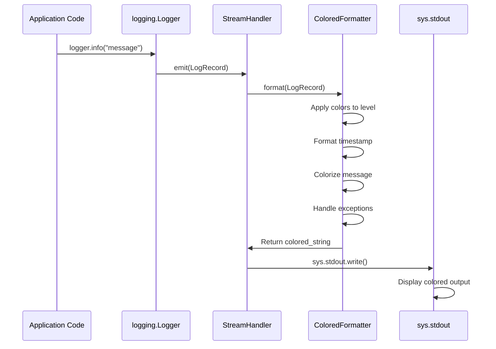

# dependency_analyzer_utils Module Documentation

## Overview

The `dependency_analyzer_utils` module provides cross-platform logging utilities with enhanced visual formatting for the CodeWiki dependency analysis system. It supplies colored, structured logging output that improves readability during code analysis operations, particularly in long-running analysis processes where visual clarity is critical.

**Module Location:** `codewiki/src/be/dependency_analyzer/utils/`

**Key Purpose:** Deliver consistent, visually distinct logging output across all dependency analysis components with minimal configuration overhead.

---

## Architecture & Design

### Module Structure

```
dependency_analyzer_utils/
├── logging_config.py
│   ├── ColoredFormatter (class)
│   ├── setup_logging() (function)
│   └── setup_module_logging() (function)
└── __init__.py
```

### Core Components

#### 1. **ColoredFormatter** (Logging Formatter)

A custom `logging.Formatter` subclass that applies semantic color coding to log output based on severity levels and component types.

**Responsibilities:**
- Transform raw log records into colored terminal output
- Apply severity-based color schemes (DEBUG, INFO, WARNING, ERROR, CRITICAL)
- Format timestamps, log levels, and messages with distinct visual styles
- Handle exception formatting and multi-line log output
- Ensure cross-platform compatibility using the `colorama` library

**Color Scheme Mapping:**

| Log Level | Color | Use Case |
|-----------|-------|----------|
| DEBUG | Cyan (dim) | Development & detailed tracing |
| INFO | Green | Standard operational messages |
| WARNING | Yellow | Attention-required conditions |
| ERROR | Red | Error conditions |
| CRITICAL | Bright Red | System-critical failures |
| Timestamp | Blue | Time reference (always) |
| Module Name | Magenta | Component identifier (reserved) |

#### 2. **setup_logging()** (Function)

Configures application-wide logging with colored console output.

**Signature:**
```python
def setup_logging(level=logging.INFO) -> None
```

**Behavior:**
- Creates a console handler bound to `sys.stdout`
- Applies `ColoredFormatter` to all log streams
- Clears existing handlers to prevent duplication
- Sets the root logger as the centralized logging point
- Enables colored output for all imported modules using Python's logging system

**Typical Usage:**
```python
# Early in application startup
setup_logging(level=logging.DEBUG)
logger = logging.getLogger(__name__)
logger.info("Application initialized")
```

#### 3. **setup_module_logging()** (Function)

Configures module-specific logging with isolation from parent loggers.

**Signature:**
```python
def setup_module_logging(module_name: str, level=logging.INFO) -> logging.Logger
```

**Behavior:**
- Creates a dedicated logger for a specific module
- Disables propagation to parent loggers (isolation)
- Clears pre-existing handlers to maintain consistency
- Returns the configured logger for immediate use
- Useful for third-party integrations or isolated subsystems

**Typical Usage:**
```python
# In a specific component module
logger = setup_module_logging('dependency_analyzer.analysis', level=logging.DEBUG)
logger.debug("Starting dependency analysis")
```

---

## Integration with System Architecture

### Dependency Relationships

The `dependency_analyzer_utils` module sits at the foundation of the logging infrastructure and is consumed by multiple analysis components:

```mermaid
graph TB
    ColoredFormatter["ColoredFormatter<br/>(logging.Formatter)"]
    SetupLogging["setup_logging()<br/>(App-Wide Config)"]
    SetupModuleLogging["setup_module_logging()<br/>(Module-Specific Config)"]
    
    AnalysisService["AnalysisService<br/>(dependency_analysis_services)"]
    CallGraphAnalyzer["CallGraphAnalyzer<br/>(dependency_analysis_services)"]
    RepoAnalyzer["RepoAnalyzer<br/>(dependency_analysis_services)"]
    
    PythonAnalyzer["PythonASTAnalyzer<br/>(language_analyzers)"]
    TreeSitterAnalyzers["TreeSitter Analyzers<br/>(language_analyzers)"]
    
    DependencyGraphBuilder["DependencyGraphBuilder<br/>(dependency_graph_construction)"]
    DependencyParser["DependencyParser<br/>(dependency_graph_construction)"]
    
    SetupLogging --> ColoredFormatter
    SetupModuleLogging --> ColoredFormatter
    
    AnalysisService -.->|uses| SetupModuleLogging
    CallGraphAnalyzer -.->|uses| SetupModuleLogging
    RepoAnalyzer -.->|uses| SetupModuleLogging
    
    PythonAnalyzer -.->|uses| SetupModuleLogging
    TreeSitterAnalyzers -.->|uses| SetupModuleLogging
    
    DependencyGraphBuilder -.->|uses| SetupModuleLogging
    DependencyParser -.->|uses| SetupModuleLogging
    
    style ColoredFormatter fill:#e1f5ff,stroke:#01579b,stroke-width:2px
    style SetupLogging fill:#c8e6c9,stroke:#1b5e20,stroke-width:2px
    style SetupModuleLogging fill:#c8e6c9,stroke:#1b5e20,stroke-width:2px
    style AnalysisService fill:#fff3e0,stroke:#e65100,stroke-width:1px
    style CallGraphAnalyzer fill:#fff3e0,stroke:#e65100,stroke-width:1px
    style RepoAnalyzer fill:#fff3e0,stroke:#e65100,stroke-width:1px
    style PythonAnalyzer fill:#f3e5f5,stroke:#4a148c,stroke-width:1px
    style TreeSitterAnalyzers fill:#f3e5f5,stroke:#4a148c,stroke-width:1px
    style DependencyGraphBuilder fill:#fce4ec,stroke:#880e4f,stroke-width:1px
    style DependencyParser fill:#fce4ec,stroke:#880e4f,stroke-width:1px
```



### Consumer Components

The following modules depend on `dependency_analyzer_utils` for logging:

1. **dependency_analysis_services** - Main analysis orchestration
   - `AnalysisService` - Central analysis coordinator
   - `CallGraphAnalyzer` - Call relationship analysis
   - `RepoAnalyzer` - Repository-wide analysis

2. **language_analyzers** - Language-specific parsing
   - `PythonASTAnalyzer` - Python code analysis
   - `TreeSitterCAnalyzer`, `TreeSitterCppAnalyzer`, etc. - Multi-language support

3. **dependency_graph_construction** - Graph building
   - `DependencyGraphBuilder` - Graph assembly
   - `DependencyParser` - Parse tree processing

4. **documentation_generation** - Documentation output
   - Logging analysis progress and results

---

## Data Flow

### Log Record Processing Pipeline



### Configuration Initialization Flow

```mermaid
graph LR
    AppStart["Application Start"]
    AppStart -->|"setup_logging()"| RootConfig["Configure Root Logger"]
    AppStart -->|"setup_module_logging('name')"| ModuleConfig["Configure Module Logger"]
    
    RootConfig --> ConsoleHandler["Create StreamHandler"]
    ConsoleHandler --> RootFormatter["Apply ColoredFormatter"]
    RootFormatter --> RootReady["Root Logger Ready"]
    
    ModuleConfig --> ModuleHandler["Create StreamHandler"]
    ModuleHandler --> ModuleFormatter["Apply ColoredFormatter"]
    ModuleFormatter --> DisablePropagation["Disable Propagation"]
    DisablePropagation --> ModuleReady["Module Logger Ready"]
    
    RootReady --> AppReady["Application Logging Active"]
    ModuleReady --> AppReady
    
    style AppStart fill:#e3f2fd,stroke:#1976d2
    style RootConfig fill:#c8e6c9,stroke:#388e3c
    style ModuleConfig fill:#c8e6c9,stroke:#388e3c
    style AppReady fill:#a5d6a7,stroke:#2e7d32,stroke-width:2px
```



---

## Usage Examples

### Example 1: Application-Wide Logging Setup

```python
# In main.py or __init__.py
import logging
from codewiki.src.be.dependency_analyzer.utils.logging_config import setup_logging

# Setup logging early in application initialization
def main():
    # Configure with DEBUG level for development
    setup_logging(level=logging.DEBUG)
    
    logger = logging.getLogger(__name__)
    logger.info("CodeWiki dependency analyzer started")
    logger.debug("Debug mode enabled")
    
    # All subsequent logging will use ColoredFormatter
    run_analysis()

if __name__ == "__main__":
    main()
```

**Output:**
```
[12:34:56] DEBUG    CodeWiki dependency analyzer started
[12:34:56] DEBUG    Debug mode enabled
```

### Example 2: Module-Specific Logging Setup

```python
# In codewiki/src/be/dependency_analyzer/analysis/analysis_service.py
import logging
from codewiki.src.be.dependency_analyzer.utils.logging_config import setup_module_logging

class AnalysisService:
    def __init__(self):
        # Setup isolated logging for this module
        self.logger = setup_module_logging(
            'dependency_analyzer.analysis_service',
            level=logging.INFO
        )
    
    def analyze_repository(self, repo_path):
        self.logger.info(f"Starting analysis of {repo_path}")
        try:
            # ... analysis code ...
            self.logger.info("Analysis completed successfully")
        except Exception as e:
            self.logger.error(f"Analysis failed: {str(e)}")
```

**Output:**
```
[14:22:10] INFO     Starting analysis of /path/to/repo
[14:22:10] INFO     Analysis completed successfully
```

### Example 3: Different Log Levels in Action

```python
# Demonstrating all log levels with colored output
import logging
from codewiki.src.be.dependency_analyzer.utils.logging_config import setup_logging

setup_logging(level=logging.DEBUG)
logger = logging.getLogger(__name__)

logger.debug("Processing file: parser.py")
logger.info("Parsed 150 dependencies")
logger.warning("Circular dependency detected in module A")
logger.error("Failed to parse invalid syntax in file.js")
logger.critical("Critical configuration error - aborting")
```

**Output (with colors):**
```
[15:45:30] DEBUG    Processing file: parser.py           [CYAN]
[15:45:30] INFO     Parsed 150 dependencies               [GREEN]
[15:45:30] WARNING  Circular dependency detected          [YELLOW]
[15:45:30] ERROR    Failed to parse invalid syntax        [RED]
[15:45:30] CRITICAL Critical configuration error          [BRIGHT RED]
```

### Example 4: Exception Logging with Traceback

```python
import logging
from codewiki.src.be.dependency_analyzer.utils.logging_config import setup_logging

setup_logging(level=logging.DEBUG)
logger = logging.getLogger(__name__)

try:
    # Analysis code that raises exception
    result = analyze_file("invalid_file.py")
except FileNotFoundError as e:
    logger.error("File not found during analysis", exc_info=True)
```

**Output (with formatted exception):**
```
[16:01:22] ERROR    File not found during analysis
Traceback (most recent call last):
  File "analyzer.py", line 45, in analyze_file
    with open(file_path) as f:
FileNotFoundError: [Errno 2] No such file or directory: 'invalid_file.py'
```

---

## Technical Specifications

### Dependencies

| Dependency | Purpose | Version |
|------------|---------|---------|
| `logging` | Standard library logging framework | Built-in |
| `sys` | System-specific parameters and functions | Built-in |
| `colorama` | Cross-platform colored terminal text | Latest stable |

### Cross-Platform Compatibility

The module uses `colorama.init(autoreset=True)` to ensure:

- **Windows:** ANSI color codes are converted to Windows console API calls
- **macOS:** ANSI codes pass through directly
- **Linux:** ANSI codes pass through directly
- **Auto-reset:** Color formatting automatically resets after each segment

### Thread Safety

The logging module is thread-safe by design. The `ColoredFormatter` extends `logging.Formatter`, which:
- Does not maintain state between format calls
- Operates purely on the `LogRecord` parameter
- Is safe for concurrent use by multiple threads

### Performance Characteristics

| Operation | Complexity | Notes |
|-----------|-----------|-------|
| `setup_logging()` | O(1) | One-time initialization |
| `setup_module_logging()` | O(1) | Per-module initialization |
| `ColoredFormatter.format()` | O(n) | Linear in message length |
| Color application | O(1) | Constant string substitution |

---

## Configuration Reference

### Logging Levels

```python
import logging
from codewiki.src.be.dependency_analyzer.utils.logging_config import setup_logging

# Level from lowest (most verbose) to highest (least verbose)
setup_logging(level=logging.DEBUG)      # Everything
setup_logging(level=logging.INFO)       # Info and above (default)
setup_logging(level=logging.WARNING)    # Warnings and above
setup_logging(level=logging.ERROR)      # Errors and above
setup_logging(level=logging.CRITICAL)   # Critical only
```

### Environment-Based Configuration

```python
import os
import logging
from codewiki.src.be.dependency_analyzer.utils.logging_config import setup_logging

# Determine log level from environment
log_level = logging.DEBUG if os.getenv('DEBUG') else logging.INFO
setup_logging(level=log_level)
```

---

## Common Patterns & Best Practices

### Pattern 1: Per-Module Logger Instance

```python
# At module level (recommended)
logger = logging.getLogger(__name__)

class MyAnalyzer:
    def run(self):
        logger.info("Analysis started")
```

### Pattern 2: Logger in Class Constructor

```python
class DependencyAnalyzer:
    def __init__(self):
        self.logger = logging.getLogger(self.__class__.__name__)
    
    def analyze(self):
        self.logger.debug("Starting analysis")
```

### Pattern 3: Contextual Logging with Prefixes

```python
import logging

class AnalysisContext:
    def __init__(self, repo_id):
        self.logger = logging.getLogger(f"analysis.{repo_id}")
        self.repo_id = repo_id
    
    def log_progress(self, message):
        self.logger.info(f"[{self.repo_id}] {message}")
```

### Pattern 4: Temporary Debug Logging

```python
import logging

# Temporarily enable debug logging for a specific module
debug_logger = logging.getLogger("dependency_analyzer.analyzers.python")
debug_logger.setLevel(logging.DEBUG)

# Your analysis code...

# Reset to normal level
debug_logger.setLevel(logging.INFO)
```

---

## Integration with Related Modules

### With dependency_analysis_services

The `AnalysisService`, `CallGraphAnalyzer`, and `RepoAnalyzer` use module logging to track:
- Analysis progress and milestones
- Dependency discovery events
- Performance metrics and timing
- Error conditions and recovery

See [dependency_analysis_services.md](dependency_analysis_services.md) for usage examples.

### With language_analyzers

Language-specific analyzers use logging to report:
- File parsing status
- Import/include discovery
- Type resolution events
- Syntax errors and warnings

See [language_analyzers.md](language_analyzers.md) for integration details.

### With dependency_graph_construction

Graph builders use logging for:
- Node creation and linking
- Circular dependency detection
- Graph optimization steps
- Serialization progress

See [dependency_graph_construction.md](dependency_graph_construction.md) for more information.

---

## Troubleshooting

### Issue: No Colored Output Visible

**Cause:** Logger not initialized or output redirected
```python
# Solution: Ensure setup_logging() is called early
from codewiki.src.be.dependency_analyzer.utils.logging_config import setup_logging
setup_logging(level=logging.DEBUG)
```

### Issue: Duplicate Log Messages

**Cause:** Multiple handlers attached to the same logger
```python
# Solution: setup_logging() automatically clears existing handlers
# If custom handlers are added, remove them first:
root_logger = logging.getLogger()
root_logger.handlers.clear()  # Clear before setup
setup_logging()
```

### Issue: Colors Not Working on Windows

**Cause:** colorama not installed or not initialized
```bash
# Solution: Ensure colorama is installed
pip install colorama

# The module automatically calls init(autoreset=True)
```

### Issue: No Logs Appearing at Console

**Cause:** Log level set too high or handler misconfigured
```python
# Solution: Lower log level and verify handler
setup_logging(level=logging.DEBUG)  # Lower level
logger = logging.getLogger(__name__)
logger.debug("This should appear")  # Test basic logging
```

---

## API Reference

### ColoredFormatter Class

```python
class ColoredFormatter(logging.Formatter):
    """Custom formatter with colored output for better readability."""
    
    COLORS: dict[str, str]
        # Mapping of log level names to colorama color codes
    
    COMPONENT_COLORS: dict[str, str]
        # Mapping of component types to colors
    
    def format(self, record: logging.LogRecord) -> str:
        """Format log record with colors.
        
        Args:
            record: LogRecord instance to format
        
        Returns:
            Formatted string with ANSI color codes
        """
```

### setup_logging Function

```python
def setup_logging(level: int = logging.INFO) -> None:
    """Set up application-wide logging with colored output.
    
    Args:
        level: Logging level (default: logging.INFO)
              One of: DEBUG, INFO, WARNING, ERROR, CRITICAL
    
    Side Effects:
        - Configures root logger
        - Clears existing handlers
        - Adds StreamHandler to sys.stdout
    """
```

### setup_module_logging Function

```python
def setup_module_logging(module_name: str, level: int = logging.INFO) -> logging.Logger:
    """Set up logging for a specific module.
    
    Args:
        module_name: Module name for the logger
        level: Logging level (default: logging.INFO)
    
    Returns:
        Configured logger instance for the module
    
    Side Effects:
        - Creates isolated logger
        - Disables propagation
        - Clears existing handlers
    """
```

---

## Design Decisions

### Why Separate setup_logging() and setup_module_logging()?

1. **Application-wide logging** (`setup_logging`):
   - Applies to all imported modules
   - Single consistent output format
   - Centralized configuration

2. **Module-specific logging** (`setup_module_logging`):
   - Isolates a module from parent loggers
   - Allows per-module configuration
   - Prevents log propagation noise

### Why Use colorama?

- **Cross-platform:** Works identically on Windows, macOS, and Linux
- **Minimal overhead:** Simple color substitution without performance impact
- **Widely tested:** Industry-standard library for colored terminal output
- **Auto-reset:** Prevents color bleeding between messages

### Why auto-reset=True?

Each log component (timestamp, level, message) gets independent color control. Without auto-reset, a single color would apply to all subsequent text, potentially affecting other log messages.

---

## Future Enhancements

1. **Log File Output:** Add option to log to file in addition to console
2. **Structured Logging:** Support JSON output format for parsing
3. **Performance Metrics:** Built-in timing and performance measurements
4. **Log Filtering:** Rule-based filtering of noisy log messages
5. **Remote Logging:** Integration with centralized logging services

---

## Related Documentation

- [dependency_analysis_services.md](dependency_analysis_services.md) - Analysis service architecture
- [language_analyzers.md](language_analyzers.md) - Language-specific parsing
- [dependency_graph_construction.md](dependency_graph_construction.md) - Graph building
- [shared_config_and_utils.md](shared_config_and_utils.md) - System configuration

---

## Glossary

| Term | Definition |
|------|-----------|
| **Log Record** | A dictionary-like object containing all information for a single logged event |
| **Formatter** | Converts LogRecord objects to strings for output |
| **Handler** | Routes LogRecords to appropriate output (console, file, etc.) |
| **Logger** | Entry point for code that wants to log messages |
| **Propagation** | The process of passing log records up the logger hierarchy |
| **ANSI Codes** | Terminal control sequences that specify text color and formatting |

---

**Last Updated:** 2024
**Module Stability:** Stable
**Python Version:** 3.8+
