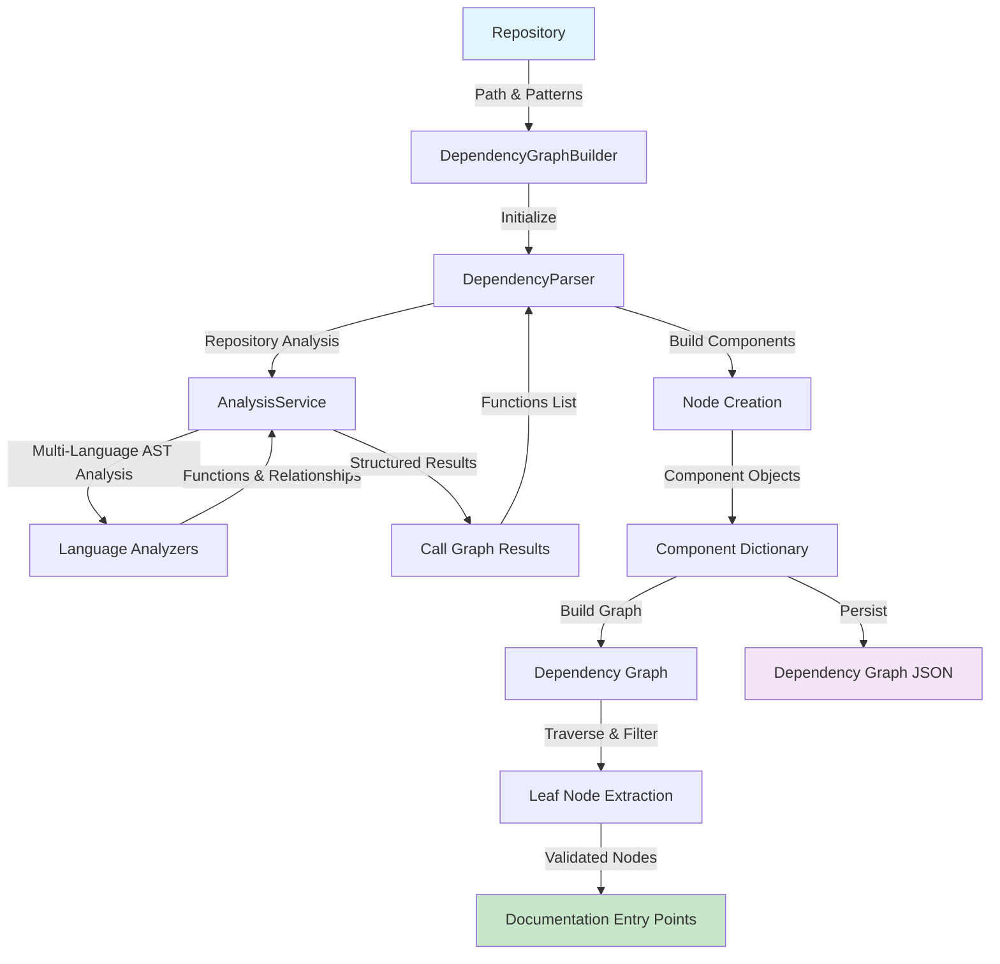
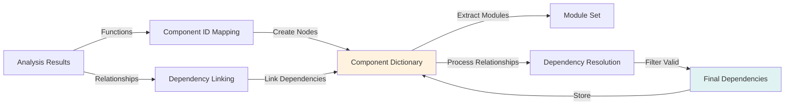
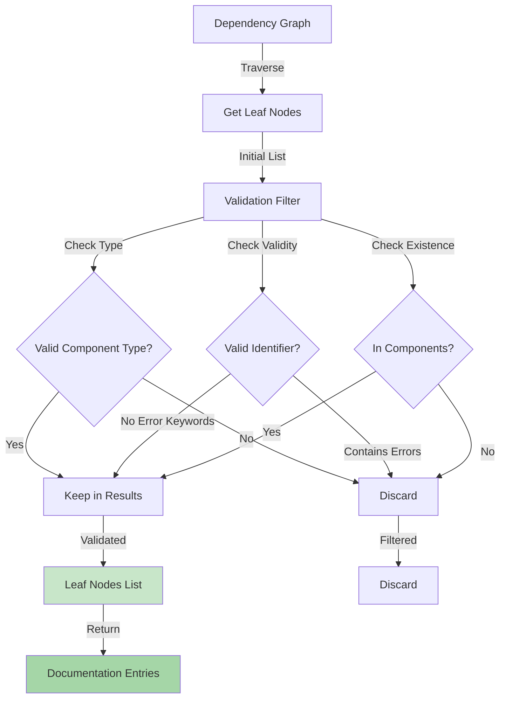

# Dependency Graph Construction Module

## Overview

The **dependency_graph_construction** module is responsible for parsing multi-language source code repositories and building comprehensive dependency graphs. It serves as the core analysis engine that transforms raw source code into structured component models with dependency relationships.

### Core Responsibilities

- **Repository Parsing**: Extract code components from multi-language repositories
- **Component Modeling**: Create `Node` objects representing code elements (classes, functions, methods, interfaces, etc.)
- **Dependency Extraction**: Identify and map relationships between code components
- **Graph Construction**: Build directed acyclic graphs representing component dependencies
- **Leaf Node Identification**: Identify entry points (leaf nodes) for documentation generation

### Module Location

```
codewiki/src/be/dependency_analyzer/
├── ast_parser.py (DependencyParser)
└── dependency_graphs_builder.py (DependencyGraphBuilder)
```

---

## Architecture

### Component Structure

```
┌─────────────────────────────────────────────────────────────┐
│            Dependency Graph Construction Module             │
│                                                             │
│  ┌────────────────────────────────────────────────────────┐ │
│  │           DependencyGraphBuilder                       │ │
│  │  Orchestrates dependency analysis and graph building   │ │
│  └────────────────────────────────────────────────────────┘ │
│                            ↓                                 │
│  ┌────────────────────────────────────────────────────────┐ │
│  │            DependencyParser                            │ │
│  │  Extracts components and builds dependency models      │ │
│  └────────────────────────────────────────────────────────┘ │
│                            ↓                                 │
│  ┌────────────────────────────────────────────────────────┐ │
│  │         AnalysisService (External)                     │ │
│  │  Multi-language AST analysis and call graph generation │ │
│  └────────────────────────────────────────────────────────┘ │
│                                                             │
└─────────────────────────────────────────────────────────────┘
```

---

## Core Components

### 1. DependencyParser

**File**: `codewiki/src/be/dependency_analyzer/ast_parser.py`

**Purpose**: Parses multi-language repositories to extract code components and their dependencies.

#### Key Responsibilities

- Initialize with repository path and file patterns (include/exclude)
- Orchestrate multi-language AST analysis via `AnalysisService`
- Build component models from analysis results
- Map component IDs and legacy identifiers
- Persist dependency graphs to JSON

#### Class Definition

```python
class DependencyParser:
    """Parser for extracting code components from multi-language repositories."""
    
    def __init__(
        self,
        repo_path: str,
        include_patterns: List[str] = None,
        exclude_patterns: List[str] = None
    )
    
    def parse_repository(
        self,
        filtered_folders: List[str] = None
    ) -> Dict[str, Node]
    
    def _build_components_from_analysis(
        self,
        call_graph_result: Dict
    )
    
    def save_dependency_graph(
        self,
        output_path: str
    )
```

#### Key Attributes

| Attribute | Type | Purpose |
|-----------|------|---------|
| `repo_path` | `str` | Absolute path to the repository |
| `components` | `Dict[str, Node]` | Extracted code components keyed by component ID |
| `modules` | `Set[str]` | Set of identified modules |
| `include_patterns` | `List[str]` | File patterns to include (e.g., `*.py`, `*.js`) |
| `exclude_patterns` | `List[str]` | File patterns to exclude |
| `analysis_service` | `AnalysisService` | Multi-language analysis orchestrator |

#### Processing Flow

1. **Initialization**: Setup parser with repository configuration and filter patterns
2. **Repository Analysis**: Invoke `AnalysisService` to perform multi-language AST analysis
3. **Component Extraction**: Create `Node` objects from analysis results
4. **Dependency Mapping**: Build dependency relationships between components
5. **Persistence**: Save component graph to JSON format

#### Example Usage

```python
parser = DependencyParser(
    repo_path="/path/to/repo",
    include_patterns=["*.py", "*.ts"],
    exclude_patterns=["*test*", "*node_modules*"]
)

components = parser.parse_repository()
parser.save_dependency_graph("dependency_graph.json")
```

---

### 2. DependencyGraphBuilder

**File**: `codewiki/src/be/dependency_analyzer/dependency_graphs_builder.py`

**Purpose**: High-level orchestrator that manages dependency analysis workflow and identifies leaf nodes for documentation.

#### Key Responsibilities

- Coordinate dependency graph construction from configuration
- Create and manage output directories
- Filter leaf nodes based on component types
- Validate and sanitize leaf node identifiers
- Return structured results for downstream processing

#### Class Definition

```python
class DependencyGraphBuilder:
    """Handles dependency analysis and graph building."""
    
    def __init__(self, config: Config)
    
    def build_dependency_graph(
        self
    ) -> tuple[Dict[str, Any], List[str]]
```

#### Key Attributes

| Attribute | Type | Purpose |
|-----------|------|---------|
| `config` | `Config` | System configuration with paths and patterns |

#### Processing Flow

1. **Setup**: Ensure output directory structure
2. **Configuration**: Extract include/exclude patterns from config
3. **Parsing**: Use `DependencyParser` to analyze repository
4. **Graph Construction**: Build traversable dependency graph
5. **Leaf Node Identification**: Extract entry points for documentation
6. **Validation**: Filter invalid/error nodes and verify component existence
7. **Return**: Components and validated leaf nodes

#### Leaf Node Selection Logic

```python
# Valid types for leaf nodes
valid_types = {"class", "interface", "struct"}

# For C-based codebases with no OOP constructs
if not available_types.intersection(valid_types):
    valid_types.add("function")

# Filter criteria
keep_leaf_nodes = [
    leaf for leaf in leaf_nodes
    if isinstance(leaf, str) 
    and leaf.strip() != ""
    and leaf in components
    and components[leaf].component_type in valid_types
    and not contains_error_keywords(leaf)
]
```

---

## Data Model

### Node (Component)

**Source**: [dependency_analyzer_models](dependency_analyzer_models.md)

The `Node` class represents a code component with the following attributes:

```python
class Node(BaseModel):
    id: str                              # Unique component identifier
    name: str                            # Component name
    component_type: str                  # Type: class, function, interface, etc.
    file_path: str                       # Absolute file path
    relative_path: str                   # Relative path from repository root
    depends_on: Set[str]                 # Set of component IDs this depends on
    source_code: Optional[str]           # Source code snippet
    start_line: int                      # Starting line number
    end_line: int                        # Ending line number
    has_docstring: bool                  # Whether component has documentation
    docstring: str                       # Documentation string
    parameters: Optional[List[str]]      # Function/method parameters
    node_type: Optional[str]             # Detailed node type
    base_classes: Optional[List[str]]    # Parent classes
    class_name: Optional[str]            # Containing class name
    display_name: Optional[str]          # Human-readable name
    component_id: Optional[str]          # Component identifier
```

---

## Workflow and Data Flow

### End-to-End Dependency Analysis Workflow



### Component Extraction Process



### Leaf Node Identification Process



---

## Integration Points

### Upstream Dependencies

The module depends on the following services:

#### 1. AnalysisService
**Source**: [dependency_analysis_services](dependency_analysis_services.md)

Multi-language AST analysis and call graph generation:
- Analyzes repository structure
- Performs language-specific AST parsing
- Extracts function/class definitions
- Identifies inter-component relationships
- Supports 9+ programming languages

#### 2. Language Analyzers
**Source**: [language_analyzers](language_analyzers.md)

Language-specific AST parsers:
- Python AST Analyzer
- TypeScript/JavaScript Tree-sitter Analyzer
- Java Tree-sitter Analyzer
- C#, C++, C, PHP, Kotlin Analyzers

### Downstream Consumers

Components that consume this module's output:

#### 1. Documentation Generation
**Source**: [documentation_generation](documentation_generation.md)

Uses the component graph and leaf nodes to:
- Select entry points for documentation
- Generate module documentation
- Create dependency visualizations

#### 2. Frontend Web Application
**Source**: [frontend_web_app](frontend_web_app.md)

Consumes the dependency graph for:
- Repository submission processing
- Background job orchestration
- Analysis result caching

---

## Configuration

The module respects the following configuration:

```python
class DependencyGraphBuilderConfig:
    repo_path: str                    # Repository to analyze
    dependency_graph_dir: str         # Output directory for graphs
    include_patterns: Optional[List[str]]  # File patterns to include
    exclude_patterns: Optional[List[str]]  # File patterns to exclude
```

### Pattern Examples

```python
# Include specific file types
include_patterns = ["*.py", "*.ts", "*.java"]

# Exclude test files and dependencies
exclude_patterns = ["*test*", "*spec*", "node_modules/*", "venv/*"]
```

---

## Error Handling and Validation

### Component Validation

```python
# Invalid identifier detection
SKIP_KEYWORDS = ['error', 'exception', 'failed', 'invalid']

invalid_identifiers = [
    identifier for identifier in leaf_nodes
    if any(keyword in identifier.lower() for keyword in SKIP_KEYWORDS)
]
```

### Leaf Node Filtering

```python
VALID_COMPONENT_TYPES = {"class", "interface", "struct", "function"}

# For C-based projects without OOP constructs
if not has_oop_components:
    add("function")

# Validate each leaf node
filtered_nodes = [
    node for node in leaf_nodes
    if node in components
    and components[node].component_type in VALID_TYPES
]
```

---

## Output Artifacts

### 1. Dependency Graph JSON

**Format**: `{repo_name}_dependency_graph.json`

Structure:
```json
{
  "path/to/file.py::ClassName.method_name": {
    "id": "path/to/file.py::ClassName.method_name",
    "name": "method_name",
    "component_type": "method",
    "file_path": "/absolute/path/to/file.py",
    "relative_path": "path/to/file.py",
    "depends_on": [
      "path/to/other.py::OtherClass",
      "path/to/util.py::helper_function"
    ],
    "source_code": "def method_name(...):\n    ...",
    "start_line": 42,
    "end_line": 55,
    "has_docstring": true,
    "docstring": "Method documentation...",
    "node_type": "function",
    "class_name": "ClassName"
  }
}
```

### 2. Leaf Nodes List

**Type**: `List[str]`

Validated entry points for documentation generation:
```python
[
    "path/to/file.py::MainClass",
    "path/to/module.py::AnotherClass",
    "src/handler.ts::RequestHandler"
]
```

---

## Key Algorithms

### Component ID Mapping

Maps multiple identifier formats to canonical component IDs:

```python
component_id_mapping = {
    # Canonical format: file::name
    "path/to/file.py::ComponentName": "path/to/file.py::ComponentName",
    
    # Legacy format: file:name
    "path/to/file.py:ComponentName": "path/to/file.py::ComponentName",
    
    # Alternative formats for different languages
    "path.to.module.ComponentName": "path/to/module.py::ComponentName"
}
```

### Module Extraction

Identifies modules from component IDs:

```python
# From Python-style IDs
"path/to/file.py::ClassName" → module = "path/to/file.py"

# From dotted paths
"path.to.module.ClassName" → module = "path.to.module"
```

### Dependency Resolution

Resolves relationships between components:

```python
for relationship in relationships:
    caller_id = resolve_id(relationship.caller)
    callee_id = resolve_id(relationship.callee)
    
    if caller_id in components and caller_id is not None:
        components[caller_id].depends_on.add(callee_id)
```

---

## Performance Characteristics

### Complexity Analysis

| Operation | Complexity | Notes |
|-----------|-----------|-------|
| Parse Repository | O(n) | Linear in number of files |
| Extract Components | O(f) | Linear in number of functions |
| Build Dependencies | O(r) | Linear in number of relationships |
| Topological Sort | O(n + e) | Standard graph algorithm |
| Leaf Node Filtering | O(l) | Linear in leaf nodes |

### Scalability Considerations

- **File Limit**: Configurable maximum files to prevent analysis timeout
- **Language Filtering**: Pre-filter by supported languages for performance
- **Pattern Matching**: Use efficient glob patterns for file filtering
- **Memory**: Component dictionary grows linearly with code size

---

## Testing Considerations

### Test Scenarios

1. **Multi-language Repository**: Verify parsing of mixed language projects
2. **Circular Dependencies**: Handle cyclic relationships gracefully
3. **Pattern Filtering**: Validate include/exclude pattern matching
4. **Invalid Identifiers**: Ensure error nodes are filtered
5. **Large Repositories**: Test with 1000+ components
6. **Edge Cases**:
   - Empty repositories
   - Missing dependencies
   - Malformed source code
   - Unusual file structures

### Example Test Cases

```python
def test_parse_simple_python_repo():
    parser = DependencyParser(repo_path)
    components = parser.parse_repository()
    assert len(components) > 0

def test_pattern_filtering():
    parser = DependencyParser(
        repo_path,
        include_patterns=["*.py"],
        exclude_patterns=["*test*"]
    )
    components = parser.parse_repository()
    # Verify only .py files are analyzed
    # Verify no test files are included

def test_leaf_node_validation():
    builder = DependencyGraphBuilder(config)
    components, leaf_nodes = builder.build_dependency_graph()
    # Verify all leaf nodes are in components
    # Verify no error keywords in names
```

---

## Related Documentation

- [dependency_analysis_services](dependency_analysis_services.md) - Multi-language analysis orchestration
- [language_analyzers](language_analyzers.md) - Language-specific AST parsing
- [dependency_analyzer_models](dependency_analyzer_models.md) - Core data models
- [documentation_generation](documentation_generation.md) - Generation from dependency graphs
- [frontend_web_app](frontend_web_app.md) - Web interface integration

---

## Glossary

| Term | Definition |
|------|-----------|
| **Component** | A code element (class, function, interface, etc.) extracted from source |
| **Node** | A `Node` object representing a component with metadata |
| **Dependency** | A relationship where component A uses/calls component B |
| **Leaf Node** | A component with no dependents; suitable as documentation entry point |
| **Call Graph** | A directed graph showing function/method call relationships |
| **AST** | Abstract Syntax Tree - parsed representation of source code |
| **Tree-sitter** | Parser generator for efficient syntax tree creation |
| **Topological Sort** | Algorithm to order nodes respecting dependencies |

---

## Future Enhancements

1. **Incremental Analysis**: Cache results and only re-analyze changed files
2. **Cycle Detection**: Identify and report circular dependency chains
3. **Quality Metrics**: Calculate component cohesion and coupling metrics
4. **Type Resolution**: Full type information for better dependency detection
5. **Performance Optimization**: Parallel multi-language analysis
6. **Extended Language Support**: Add more programming languages
7. **Visualization**: Generate interactive dependency visualizations

---

*Last Updated: 2024*
*Module Version: 1.0*
