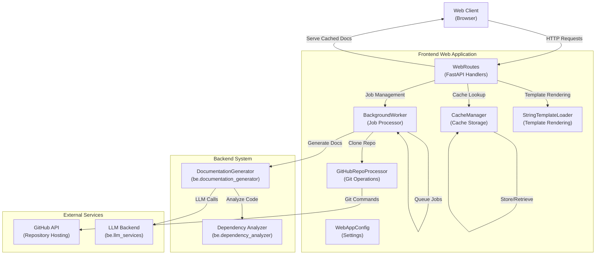
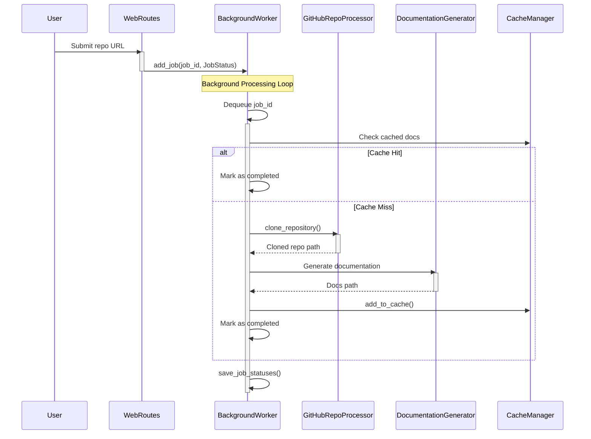
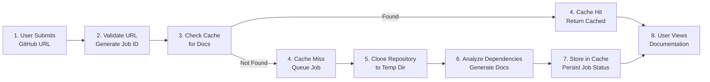
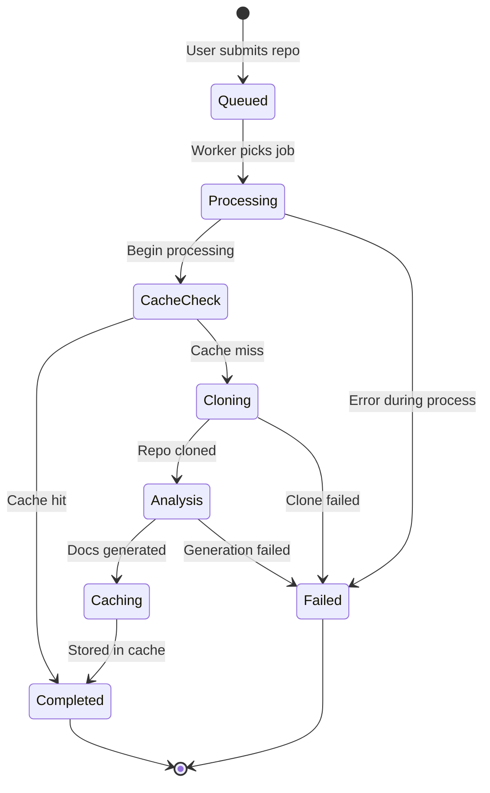

# Frontend Web App Module Documentation

## Overview

The **frontend_web_app** module provides a web-based interface for the CodeWiki documentation generation system. It enables users to submit GitHub repositories through a web UI, manages asynchronous documentation generation jobs, handles caching of generated documentation, and serves the results through a web server.

**Module Location**: `codewiki/src/fe/`

**Purpose**: Bridge between users and the backend documentation generation system, providing job management, caching, and web interface capabilities.

---

## Module Architecture

### System Component Hierarchy



---

## Core Components

### 1. WebRoutes

**File**: `codewiki/src/fe/routes.py`

**Purpose**: Handles all HTTP endpoints for the web application using FastAPI.

**Key Responsibilities**:
- Manage the main web interface route (form submission and job listing)
- Accept GitHub repository URLs and commit IDs from users
- Generate and track job IDs
- Serve job status information via API
- Display generated documentation

**Key Methods**:
- `index_get()` - Render the main web interface
- `index_post()` - Process repository submission forms
- `get_job_status()` - API endpoint returning job status
- `view_docs()` - Redirect to documentation viewer
- `serve_generated_docs()` - Serve generated documentation files
- `_normalize_github_url()` - Standardize GitHub URLs for comparison
- `_repo_full_name_to_job_id()` / `_job_id_to_repo_full_name()` - Convert between formats
- `cleanup_old_jobs()` - Remove expired job records

**Data Flows**:
1. **Repository Submission Flow**:
   - User submits URL and optional commit ID
   - Validates GitHub URL format
   - Checks cache for existing documentation
   - Creates JobStatus and queues in BackgroundWorker
   - Returns confirmation to user

2. **Documentation Serving Flow**:
   - User requests generated documentation
   - Retrieves job status or reconstructs from cache
   - Loads module tree and metadata
   - Converts markdown to HTML
   - Renders with DOCS_VIEW_TEMPLATE

---

### 2. BackgroundWorker

**File**: `codewiki/src/fe/background_worker.py`

**Purpose**: Asynchronous job processor that generates documentation in the background without blocking web requests.

**Key Responsibilities**:
- Maintain a queue of documentation generation jobs
- Process jobs in a dedicated background thread
- Clone repositories and generate documentation
- Track job progress and status
- Persist job status to disk for recovery
- Handle errors and cleanup

**Key Methods**:
- `start()` / `stop()` - Control worker thread lifecycle
- `add_job()` - Queue a new documentation generation job
- `get_job_status()` - Retrieve status of a specific job
- `get_all_jobs()` - List all tracked jobs
- `_worker_loop()` - Main loop processing queue items
- `_process_job()` - Single job execution logic
- `load_job_statuses()` / `save_job_statuses()` - Persistence operations
- `_reconstruct_jobs_from_cache()` - Backward compatibility recovery

**Job States**:
- `queued` - Waiting to be processed
- `processing` - Currently generating documentation
- `completed` - Successfully generated and cached
- `failed` - Generation failed with error

**Process Flow**:



---

### 3. CacheManager

**File**: `codewiki/src/fe/cache_manager.py`

**Purpose**: Manages caching of generated documentation to avoid redundant processing.

**Key Responsibilities**:
- Store and retrieve generated documentation
- Track cache metadata (creation time, access time)
- Enforce cache expiration policy
- Maintain cache index on disk
- Generate repository URL hashes for lookup

**Key Methods**:
- `load_cache_index()` / `save_cache_index()` - Disk persistence
- `get_repo_hash()` - Generate deterministic hash for repo URLs
- `get_cached_docs()` - Retrieve cached documentation if valid
- `add_to_cache()` - Store newly generated documentation
- `remove_from_cache()` - Remove documentation entry
- `cleanup_expired_cache()` - Purge old cache entries

**Cache Structure**:
```
cache/
├── cache_index.json      # Maps repo hash → cache entry metadata
└── [repo-specific-docs]/
    ├── module_tree.json
    ├── metadata.json
    ├── *.md files
    └── static assets
```

**Expiration Policy**:
- Default expiry: 365 days
- Configurable via `CACHE_EXPIRY_DAYS`
- Last accessed time updated on retrieval

---

### 4. GitHubRepoProcessor

**File**: `codewiki/src/fe/github_processor.py`

**Purpose**: Handles GitHub repository operations and URL parsing.

**Key Responsibilities**:
- Validate GitHub repository URLs
- Extract repository metadata from URLs
- Clone repositories using git commands
- Support optional specific commit checkout
- Handle shallow vs full clones

**Key Methods**:
- `is_valid_github_url()` - Validate URL format
- `get_repo_info()` - Extract owner, repo, full_name, clone_url
- `clone_repository()` - Clone repo with optional commit checkout

**Git Operations**:
- Shallow clone (depth=1) by default for faster processing
- Full clone when specific commit ID is requested
- Timeout protection (default 300 seconds)
- Error handling with stderr capture

---

### 5. WebAppConfig

**File**: `codewiki/src/fe/config.py`

**Purpose**: Centralized configuration for web application settings.

**Key Configuration Parameters**:
```python
# Directories
CACHE_DIR = "./output/cache"           # Documentation cache storage
TEMP_DIR = "./output/temp"             # Temporary repository clones
OUTPUT_DIR = "./output"                # Base output directory

# Queue Settings
QUEUE_SIZE = 100                       # Max concurrent queued jobs

# Cache Settings
CACHE_EXPIRY_DAYS = 365               # Cache validity period

# Job Management
JOB_CLEANUP_HOURS = 24000             # Job record retention (1000 days)
RETRY_COOLDOWN_MINUTES = 3            # Min wait between retries

# Server Settings
DEFAULT_HOST = "127.0.0.1"            # Server bind address
DEFAULT_PORT = 8000                   # Server port

# Git Settings
CLONE_TIMEOUT = 300                   # Git clone timeout (seconds)
CLONE_DEPTH = 1                       # Default clone depth (shallow)
```

**Methods**:
- `ensure_directories()` - Create required directories
- `get_absolute_path()` - Resolve relative paths

---

### 6. StringTemplateLoader

**File**: `codewiki/src/fe/template_utils.py`

**Purpose**: Provides Jinja2 template rendering capabilities for HTML generation.

**Key Responsibilities**:
- Load templates from strings (vs files)
- Render HTML with context variables
- Generate navigation from module tree
- Format job lists

**Key Functions**:
- `render_template()` - Main rendering with Jinja2
- `render_navigation()` - Generate navigation HTML from module tree
- `render_job_list()` - Format job status list

---

## Data Models

### JobStatus

```python
@dataclass
class JobStatus:
    job_id: str              # Unique identifier
    repo_url: str            # GitHub repository URL
    status: str              # queued|processing|completed|failed
    created_at: datetime     # Submission timestamp
    started_at: Optional[datetime]    # Processing start
    completed_at: Optional[datetime]  # Completion timestamp
    error_message: Optional[str]      # Error details if failed
    progress: str            # Current progress message
    docs_path: Optional[str] # Path to generated documentation
    commit_id: Optional[str] # Optional specific commit ID
    main_model: Optional[str] # LLM model used
```

### CacheEntry

```python
@dataclass
class CacheEntry:
    repo_url: str          # GitHub repository URL
    repo_url_hash: str     # Short hash for lookup
    docs_path: str         # Path to cached documentation
    created_at: datetime   # Creation timestamp
    last_accessed: datetime # Last retrieval timestamp
```

### JobStatusResponse

```python
@dataclass
class JobStatusResponse:
    # Same structure as JobStatus, used for API responses
```

---

## Integration Points

### Backend Integration

**1. Documentation Generation**:
- Imports `DocumentationGenerator` from `codewiki.src.be.documentation_generator`
- Creates config and passes to generator
- Runs async generation in event loop
- Stores results in cache

**2. Dependency Analysis**:
- Accessed through DocumentationGenerator
- Analyzes repository structure
- Builds dependency graphs

**3. LLM Backend**:
- Used by DocumentationGenerator for content generation
- Model selection via environment variables

### External Services

**1. GitHub**:
- Repository cloning via `git clone` command
- Support for SSH and HTTPS protocols
- Commit-specific checkout capability

**2. File System**:
- Temporary storage for cloned repositories
- Cache storage for generated documentation
- Job status persistence

---

## Data Flow Diagrams

### End-to-End Repository Processing



### Job Processing States



---

## Process Flows

### Repository Submission Process

```mermaid
sequenceDiagram
    participant User as User
    participant Web as FastAPI<br/>Routes
    participant Validate as URL<br/>Validator
    participant Cache as Cache<br/>Manager
    participant Queue as Background<br/>Worker
    
    User->>+Web: POST /submit<br/>(repo_url, commit_id)
    
    Web->>+Validate: is_valid_github_url()
    alt Invalid URL
        Validate-->>Web: false
        Web-->>-User: Error: Invalid URL
    else Valid URL
        Validate-->>Web: true
        
        Web->>+Cache: get_cached_docs()
        alt Cache Hit
            Cache-->>Web: docs_path
            Web-->>-User: Redirect to cached docs
        else Cache Miss
            Cache-->>Web: None
            
            Web->>+Queue: add_job(job_id,<br/>JobStatus)
            Queue-->>-Web: queued
            Web-->>-User: Job queued<br/>(Job ID: X)
        end
    end
```

### Documentation Serving Process

```mermaid
sequenceDiagram
    participant User as User
    participant Web as FastAPI<br/>Routes
    participant Worker as Background<br/>Worker
    participant Cache as Cache<br/>Manager
    participant DocGen as Doc<br/>Generator
    participant Git as GitHub<br/>Processor
    
    User->>+Web: View documentation<br/>(job_id)
    
    Web->>+Worker: get_job_status(job_id)
    Worker-->>-Web: JobStatus
    
    alt Completed
        Web->>Web: Load docs_path
        Web->>Web: Parse module_tree.json
        Web->>Web: Convert MD to HTML
        Web-->>-User: Rendered documentation
    else Processing
        Web-->>-User: Job still processing
    else Failed
        Web-->>-User: Job failed<br/>(show error)
    else Not Found
        alt Check cache by ID
            Web->>+Cache: get_cached_docs()
            Cache-->>-Web: docs_path
            Web->>Web: Reconstruct JobStatus
            Web->>Web: Serve from cache
            Web-->>-User: Cached documentation
        else Cache miss
            Web-->>-User: Job not found (404)
        end
    end
```

---

## Configuration & Deployment

### Environment Setup

```bash
# Ensure directories exist
python -c "from codewiki.src.fe.config import WebAppConfig; WebAppConfig.ensure_directories()"

# Set environment variables (optional)
export CODEWIKI_CACHE_DIR="./output/cache"
export CODEWIKI_TEMP_DIR="./output/temp"
export CODEWIKI_MAIN_MODEL="claude-3-5-sonnet-20241022"
```

### Running the Web Server

```python
from fastapi import FastAPI
from codewiki.src.fe.background_worker import BackgroundWorker
from codewiki.src.fe.cache_manager import CacheManager
from codewiki.src.fe.routes import WebRoutes
from codewiki.src.fe.config import WebAppConfig

# Initialize components
WebAppConfig.ensure_directories()
cache_manager = CacheManager()
background_worker = BackgroundWorker(cache_manager)
web_routes = WebRoutes(background_worker, cache_manager)

# Start background processing
background_worker.start()

# Setup FastAPI
app = FastAPI()

# Register routes
app.add_api_route("/", web_routes.index_get, methods=["GET"])
app.add_api_route("/", web_routes.index_post, methods=["POST"])
app.add_api_route("/api/job/{job_id}", web_routes.get_job_status)
app.add_api_route("/api/view/{job_id}", web_routes.view_docs)
app.add_api_route("/static-docs/{job_id}/{filename:path}", web_routes.serve_generated_docs)
```

---

## Error Handling & Recovery

### Job Failure Recovery

1. **Persistent Job Status**: Job statuses saved to disk in `cache/jobs.json`
2. **Backward Compatibility**: Can reconstruct from cache entries if job file missing
3. **Retry Cooldown**: Prevents rapid retry loops (configurable via `RETRY_COOLDOWN_MINUTES`)

### Cache Consistency

1. **Expiration Cleanup**: `cleanup_expired_cache()` removes stale entries
2. **Hash-Based Lookup**: Deterministic URL hashing prevents duplicate caching
3. **Last Accessed Tracking**: Enables access-time-based cache eviction

### Temporary File Cleanup

```python
# Automatic cleanup in _process_job()
finally:
    if os.path.exists(temp_repo_dir):
        subprocess.run(['rm', '-rf', temp_repo_dir], check=True)
```

---

## Dependencies

### Internal Dependencies

| Module | Purpose | Reference |
|--------|---------|-----------|
| backend_models | Documentation generation core | `DocumentationGenerator` |
| dependency_analyzer | Code analysis | Via DocumentationGenerator |
| frontend_models | Data models | `JobStatus`, `CacheEntry` |
| shared_config_and_utils | Utilities | `FileManager`, `Config` |

### External Dependencies

| Package | Purpose |
|---------|---------|
| `fastapi` | Web framework |
| `jinja2` | Template rendering |
| `subprocess` | Git operations |
| `asyncio` | Async job processing |
| `pathlib` | Path operations |
| `dataclasses` | Data model definitions |

---

## Performance Considerations

### Caching Strategy

- **Cache Hit Rate**: Improved by repository URL normalization
- **Expiry Period**: 365 days balances freshness and storage
- **Hash-Based Lookup**: O(1) cache lookups

### Concurrency

- **Single Background Thread**: Sequential job processing
- **Non-Blocking Web Interface**: FastAPI handles concurrent requests
- **Queue Size**: Configurable limit (default 100) prevents memory bloat

### Resource Management

- **Temporary Storage**: Cleaned up after each job
- **Shallow Clones**: Reduces clone time and storage (depth=1)
- **Job Cleanup**: Old records removed after `JOB_CLEANUP_HOURS`

---

## Testing & Monitoring

### Key Metrics to Monitor

1. **Job Processing Time**: Time from queue to completion
2. **Cache Hit Rate**: Percentage of cached vs new documentation
3. **Worker Queue Depth**: Number of pending jobs
4. **Error Rate**: Failed job percentage

### Sample Monitoring Code

```python
from codewiki.src.fe.background_worker import BackgroundWorker

worker = BackgroundWorker(cache_manager)

# Get statistics
all_jobs = worker.get_all_jobs()
completed = sum(1 for j in all_jobs.values() if j.status == 'completed')
failed = sum(1 for j in all_jobs.values() if j.status == 'failed')
queued = sum(1 for j in all_jobs.values() if j.status == 'queued')

print(f"Completed: {completed}, Failed: {failed}, Queued: {queued}")
```

---

## Architecture Patterns

### Asynchronous Processing Pattern

The module implements the **asynchronous job queue pattern**:
- Web requests are non-blocking
- Long-running tasks processed in background
- Clients can poll for job status
- Results cached for fast retrieval

### Layered Architecture

```
┌─────────────────────────────────────┐
│      Web Interface Layer             │
│   (FastAPI Routes + Templates)      │
├─────────────────────────────────────┤
│      Application Layer               │
│  (WebRoutes, Job Management)        │
├─────────────────────────────────────┤
│      Service Layer                   │
│ (BackgroundWorker, CacheManager,    │
│  GitHubRepoProcessor)               │
├─────────────────────────────────────┤
│      Data Layer                      │
│ (File Storage, Cache Persistence)   │
├─────────────────────────────────────┤
│      External Services               │
│  (GitHub, LLM Backend, Docs Gen)    │
└─────────────────────────────────────┘
```

---

## Future Enhancement Opportunities

1. **WebSocket Support**: Real-time job progress updates
2. **Rate Limiting**: Prevent abuse of submission API
3. **Authentication**: User accounts and usage tracking
4. **Database Backend**: Replace file-based job persistence
5. **Distributed Processing**: Multiple worker instances
6. **Advanced Caching**: Cache invalidation based on repo updates
7. **Documentation Diff**: Highlight changes between versions

---

## Related Documentation

- See documentation files for `DocumentationGenerator` details
- See frontend models documentation for complete data model definitions
- See shared config documentation for utility functions
- See dependency analyzer documentation for analysis models
