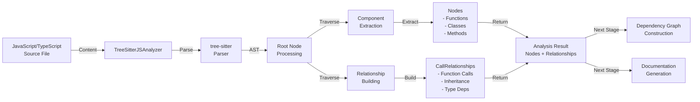
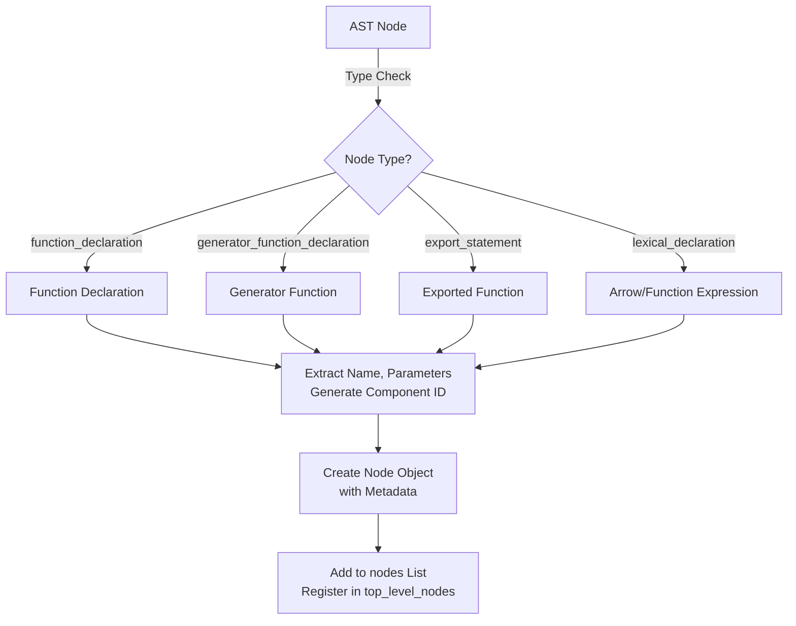
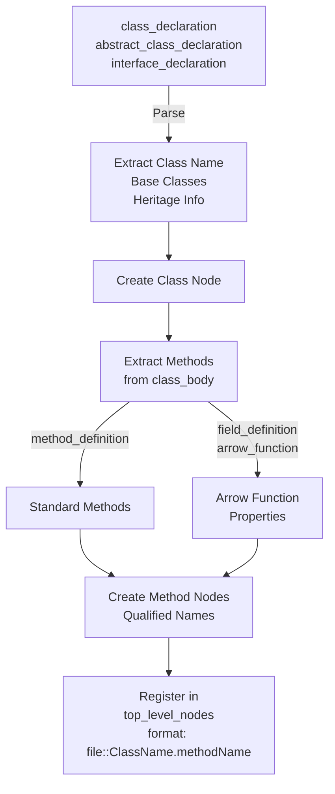
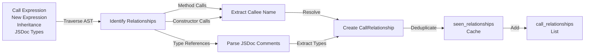
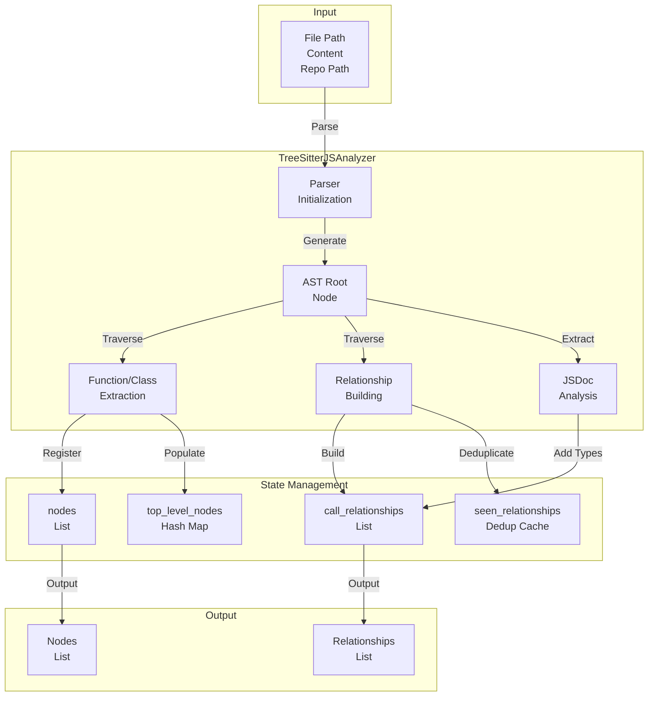
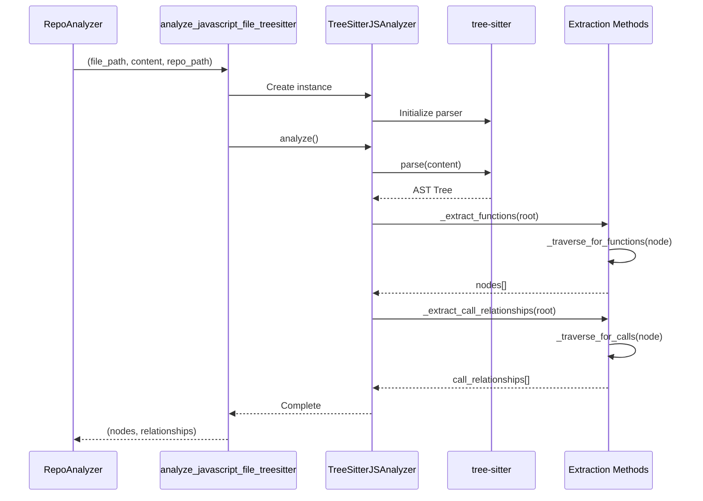

# JavaScript Analyzer Module Documentation

## Overview

The **JavaScript Analyzer Module** is a core component of the CodeWiki dependency analysis system, responsible for parsing and analyzing JavaScript/TypeScript source files to extract function definitions, class declarations, method definitions, and call relationships. It leverages the **tree-sitter** parser for robust AST (Abstract Syntax Tree) analysis, supporting modern JavaScript and TypeScript syntax.

### Key Responsibilities

- **Code Parsing**: Parse JavaScript/TypeScript files into AST using tree-sitter
- **Component Extraction**: Identify and extract functions, classes, methods, and arrow functions
- **Relationship Mapping**: Build call graphs and inheritance relationships between components
- **Type Resolution**: Extract type information from JSDoc comments for type dependency analysis
- **Metadata Generation**: Generate component IDs, relative paths, and source code snippets

---

## Architecture Overview

### Module Structure

```
javascript_analyzer.py
├── TreeSitterJSAnalyzer (Main Class)
│   ├── Parser Initialization
│   ├── AST Traversal Engine
│   ├── Component Extraction
│   ├── Relationship Building
│   └── JSDoc Analysis
└── analyze_javascript_file_treesitter() (Public API)
```

### Core Component: TreeSitterJSAnalyzer

The `TreeSitterJSAnalyzer` class is the primary component that:

1. **Initializes tree-sitter parser** for JavaScript/TypeScript
2. **Traverses AST nodes** to identify code structures
3. **Extracts metadata** about functions, classes, and methods
4. **Builds relationship graphs** showing how components call each other
5. **Manages component identifiers** in a consistent format

#### Class Attributes

| Attribute | Type | Purpose |
|-----------|------|---------|
| `file_path` | `Path` | Absolute path to the analyzed file |
| `content` | `str` | Source code content as string |
| `repo_path` | `str` | Repository root path for relative path calculation |
| `nodes` | `List[Node]` | Extracted function and class definitions |
| `call_relationships` | `List[CallRelationship]` | Function calls and dependencies |
| `top_level_nodes` | `dict` | Hash map of nodes for quick lookup |
| `seen_relationships` | `set` | Deduplication cache for relationships |
| `parser` | `Parser` | tree-sitter parser instance |
| `js_language` | `Language` | tree-sitter language definition |

---

## Data Flow & Processing Pipeline



---

## Component Extraction Process

### 1. Function Declaration Extraction

The analyzer identifies and extracts different function declaration types:



### 2. Class & Method Extraction



### 3. Relationship Building



---

## Key Processing Methods

### Initialization & Core Analysis

| Method | Purpose |
|--------|---------|
| `__init__(file_path, content, repo_path)` | Initialize parser and set up analyzer state |
| `analyze()` | Main entry point - parse file and extract components |
| `_extract_functions(node)` | Recursively extract all function declarations |
| `_extract_call_relationships(node)` | Build call graph from AST traversal |

### Component Extraction Methods

| Method | Purpose |
|--------|---------|
| `_traverse_for_functions(node)` | Recursive AST traversal for functions/classes |
| `_extract_function_declaration(node)` | Extract standard function declarations |
| `_extract_exported_function(node)` | Handle export statements |
| `_extract_arrow_function_from_declaration(node)` | Extract const/let/var = arrow function patterns |
| `_extract_class_declaration(node)` | Extract class/interface definitions |
| `_extract_methods_from_class(class_node, class_name)` | Extract methods from class body |
| `_create_method_node(node, method_name, class_name)` | Create Node object for methods |

### Relationship Building Methods

| Method | Purpose |
|--------|---------|
| `_traverse_for_calls(node, current_top_level)` | Traverse AST for call expressions |
| `_extract_call_from_node(node, caller_name)` | Extract individual function call |
| `_extract_jsdoc_type_dependencies(node, caller_name)` | Parse JSDoc comments for types |
| `_parse_jsdoc_types(comment_text, caller_name, line_number)` | Extract type references from JSDoc |
| `_is_builtin_type_js(name)` | Filter out built-in types |

### AST Navigation & Utilities

| Method | Purpose |
|--------|---------|
| `_find_child_by_type(node, node_type)` | Find first child of specific AST type |
| `_get_node_text(node)` | Extract text content from AST node |
| `_find_containing_class(node)` | Find parent class for nested methods |
| `_extract_parameters(node)` | Extract function parameters from AST |
| `_extract_callee_name(call_node)` | Get function name being called |

### Identifier Management

| Method | Purpose |
|--------|---------|
| `_get_component_id(name, class_name, is_method)` | Generate standardized component ID |
| `_get_module_path()` | Get module path (file without extension) |
| `_get_relative_path()` | Calculate relative path from repo root |

---

## Component ID Format

The analyzer generates standardized component IDs for tracking and linking:

```
# Functions and Classes
relative_path.to.file::FunctionName
relative_path.to.file::ClassName

# Methods and Class Members
relative_path.to.file::ClassName.methodName

# Examples
src.utils.helpers::parseJSON
src.services.user::UserService
src.services.user::UserService.getUser
```

---

## Relationship Types

The analyzer builds different types of relationships:

### 1. Function Calls
```javascript
function caller() {
  callee();  // Creates CallRelationship: caller -> callee
}
```

### 2. Method Calls
```javascript
class MyClass {
  caller() {
    this.callee();  // Detected as method call
  }
  callee() {}
}
```

### 3. Constructor Calls (new expressions)
```javascript
const obj = new MyClass();  // Creates relationship to MyClass constructor
```

### 4. Inheritance
```javascript
class Child extends Parent {
  // Creates relationship: Child -> Parent
}
```

### 5. Type Dependencies from JSDoc
```javascript
/**
 * @param {UserService} service
 * @returns {Promise<User>}
 */
function fetchUser(service) {}
// Extracts: fetchUser -> UserService
```

---

## Supported JavaScript/TypeScript Constructs

### Function Declarations
- ✅ Standard function declarations: `function name() {}`
- ✅ Async functions: `async function name() {}`
- ✅ Generator functions: `function* name() {}`
- ✅ Async generators: `async function* name() {}`

### Function Expressions & Arrow Functions
- ✅ Variable declarations: `const fn = () => {}`
- ✅ Let/var declarations: `let fn = function() {}`
- ✅ Arrow functions: `const fn = (a, b) => a + b`
- ✅ Function expressions: `const fn = function(x) {}`

### Class Constructs
- ✅ Class declarations: `class MyClass {}`
- ✅ Abstract classes: `abstract class MyClass {}`
- ✅ Interface declarations: `interface MyInterface {}`
- ✅ Method definitions: `methodName() {}`
- ✅ Arrow function properties: `handler = () => {}`
- ✅ Class inheritance: `class Child extends Parent {}`

### Export Patterns
- ✅ Named exports: `export function name() {}`
- ✅ Default exports: `export default function() {}`
- ✅ Export statements: `export { name }`

### Call Patterns
- ✅ Direct function calls: `function()`
- ✅ Method calls: `obj.method()`
- ✅ Chained calls: `obj.method1().method2()`
- ✅ This/super calls: `this.method()`, `super.method()`
- ✅ Await expressions: `await asyncFunction()`

### JSDoc Type References
- ✅ Parameter types: `@param {TypeName}`
- ✅ Return types: `@returns {TypeName}`
- ✅ Type definitions: `@type {TypeName}`
- ✅ Generic types: `@param {Array<Item>}`
- ✅ Union types: `@param {Type1 | Type2}`

---

## Integration Points

### Upstream (Inputs)

The analyzer receives:
- **File Path**: Absolute path to JavaScript/TypeScript file
- **File Content**: Source code as string
- **Repository Path**: Optional repo root for relative path calculation

**Source**: [dependency_analysis_services](dependency_analysis_services.md) - RepoAnalyzer or AnalysisService

### Downstream (Outputs)

The analyzer produces:
- **Nodes**: List of extracted components (functions, classes, methods)
- **CallRelationships**: List of dependencies between components

**Consumers**:
- [dependency_graph_construction](dependency_graph_construction.md) - Builds dependency graphs
- [documentation_generation](documentation_generation.md) - Generates documentation from analysis
- [dependency_analysis_services](dependency_analysis_services.md) - Aggregates results

---

## Error Handling & Robustness

### Parser Initialization
```python
try:
    language_capsule = tree_sitter_javascript.language()
    self.js_language = Language(language_capsule)
    self.parser = Parser(self.js_language)
except Exception as e:
    logger.error(f"Failed to initialize JavaScript parser: {e}")
    self.parser = None  # Graceful degradation
```

### File Analysis
```python
if self.parser is None:
    logger.warning(f"Skipping {self.file_path} - parser initialization failed")
    return

try:
    tree = self.parser.parse(bytes(self.content, "utf8"))
    # Analysis continues...
except Exception as e:
    logger.error(f"Error analyzing JavaScript file {self.file_path}: {e}", exc_info=True)
```

### Relationship Deduplication
```python
rel_key = (relationship.caller, relationship.callee, relationship.call_line)
if rel_key not in self.seen_relationships:
    self.seen_relationships.add(rel_key)
    self.call_relationships.append(relationship)
```

---

## Built-in Type Filtering

The analyzer filters out built-in JavaScript types to avoid noise:

```
Primitive Types: string, number, boolean, object, void, any, null, undefined
JavaScript Objects: Array, Promise, Date, RegExp, Error, Map, Set, Function
DOM Types: Element, HTMLElement, Document, Window, Event, Node
Web APIs: Response, Request, Headers, URL, Blob, File
Generic Parameters: T, U, V, K (for generic type definitions)
```

---

## Performance Characteristics

| Aspect | Details |
|--------|---------|
| **Parsing** | Single-pass tree-sitter parsing with linear time complexity O(n) where n = file size |
| **Extraction** | Tree traversal with O(n) complexity |
| **Deduplication** | O(1) hash set lookups for relationship deduplication |
| **Memory** | Stores complete AST in memory; suitable for files up to ~100K lines |
| **Optimization** | Early termination for parser initialization failures |

---

## Related Modules Reference

- **[dependency_analysis_services](dependency_analysis_services.md)** - Service layer that orchestrates analysis
- **[dependency_graph_construction](dependency_graph_construction.md)** - Consumes analysis results to build graphs
- **[documentation_generation](documentation_generation.md)** - Generates docs from extracted components
- **[typescript_analyzer](typescript_analyzer.md)** - Specialized TypeScript analyzer (shares similar approach)
- **[language_analyzers](language_analyzers.md)** - Parent documentation for all language analyzers

---

## Public API

### Main Function
```python
def analyze_javascript_file_treesitter(
    file_path: str,
    content: str,
    repo_path: str = None
) -> Tuple[List[Node], List[CallRelationship]]:
    """
    Analyze a JavaScript/TypeScript file and extract components and relationships.
    
    Args:
        file_path: Path to the JavaScript file
        content: Source code content
        repo_path: Optional repository root path
        
    Returns:
        Tuple of (extracted_nodes, call_relationships)
    """
```

### Usage Example
```python
from codewiki.src.be.dependency_analyzer.analyzers.javascript import (
    analyze_javascript_file_treesitter
)

# Analyze a file
nodes, relationships = analyze_javascript_file_treesitter(
    file_path="/project/src/utils.js",
    content=open("/project/src/utils.js").read(),
    repo_path="/project"
)

# nodes: List[Node] - Contains functions, classes, methods
# relationships: List[CallRelationship] - Contains function calls and dependencies
```

---

## Data Models

### Node Structure
Represents extracted components (functions, classes, methods):

```python
Node(
    id: str,                    # Unique identifier
    name: str,                  # Component name
    component_type: str,        # "function", "class", "method"
    file_path: str,            # Absolute file path
    relative_path: str,        # Path relative to repo
    source_code: str,          # Source code snippet
    start_line: int,           # Starting line number
    end_line: int,             # Ending line number
    has_docstring: bool,       # Whether has documentation
    docstring: str,            # Documentation text
    parameters: List[str],     # Function parameters
    node_type: str,            # AST node type
    base_classes: List[str],   # Parent classes (for classes)
    class_name: str,           # Containing class (for methods)
    display_name: str,         # Human-readable name
    component_id: str          # Standardized ID
)
```

### CallRelationship Structure
Represents dependencies between components:

```python
CallRelationship(
    caller: str,               # Component ID of caller
    callee: str,              # Component ID of callee
    call_line: int,           # Line number of call
    is_resolved: bool         # Whether callee is in same file
)
```

---

## Mermaid Diagram: Module Architecture



---

## Mermaid Diagram: Processing Pipeline



---

## Testing Considerations

When testing the JavaScript analyzer, consider:

1. **Parser Initialization**
   - Verify tree-sitter dependencies are installed
   - Handle cases where parser initialization fails

2. **AST Traversal**
   - Test with various JavaScript/TypeScript patterns
   - Verify correct node type detection

3. **Component Extraction**
   - Validate function, class, and method extraction
   - Test edge cases (nested classes, arrow functions, async/generators)

4. **Relationship Building**
   - Verify call relationships are correctly identified
   - Test method call vs function call distinction
   - Validate JSDoc type parsing

5. **Component IDs**
   - Confirm ID generation format consistency
   - Test relative path calculation

---

## Common Issues & Solutions

| Issue | Cause | Solution |
|-------|-------|----------|
| Parser initialization fails | tree-sitter dependencies missing | Install `tree-sitter` and `tree-sitter-javascript` |
| No nodes extracted | File syntax not recognized | Check file extension and syntax validity |
| Relationships incomplete | JSDoc comments malformed | Validate JSDoc format in source |
| Duplicate relationships | Traversal visits nodes multiple times | Deduplication cache validates prevents this |
| Wrong component IDs | Relative path calculation error | Verify `repo_path` parameter is set correctly |

---

## Version History & Compatibility

- **Target Language**: JavaScript (ES6+) and TypeScript (4.0+)
- **Parser**: tree-sitter with tree-sitter-javascript
- **Dependencies**: See [language_analyzers](language_analyzers.md) for full dependency list

---

## Summary

The **JavaScript Analyzer Module** provides robust extraction of JavaScript/TypeScript code structure through tree-sitter-based AST analysis. It serves as a critical component in the dependency analysis pipeline, enabling accurate identification of functions, classes, methods, and their relationships. The analyzer's support for modern JavaScript patterns, JSDoc type analysis, and deduplication mechanisms makes it a reliable foundation for documentation generation and code analysis workflows.
