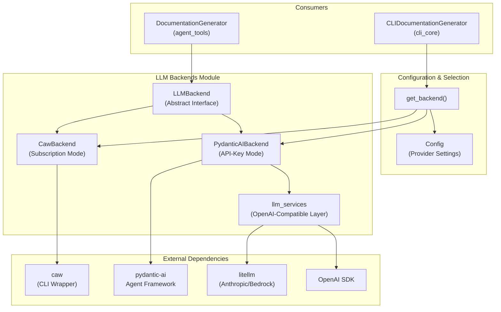
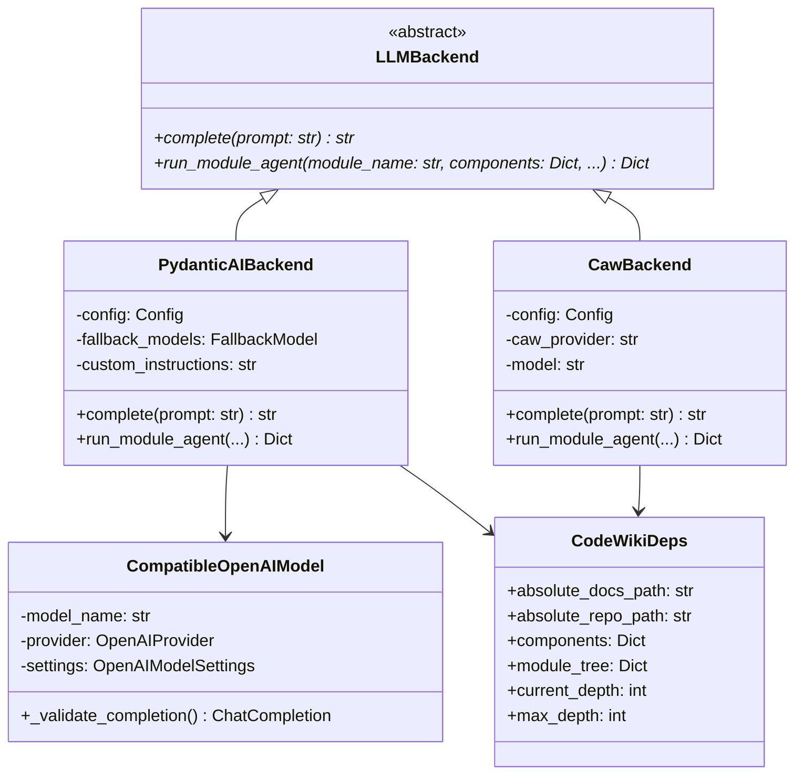

# LLM Backends Module

## Overview

The **llm_backends** module provides a unified abstraction layer for LLM operations in CodeWiki, supporting two fundamentally different execution paths:

1. **Synchronous Single-Shot Completions** — Used for clustering, overview generation, and parent module documentation
2. **Asynchronous Agentic Loops** — Used for per-module documentation generation with custom tools and recursion

This module decouples the documentation generation pipeline from specific LLM providers, enabling CodeWiki to operate in two distinct modes:
- **API-Key Mode** (`PydanticAIBackend`) — Using OpenAI, Anthropic, Bedrock, or Azure OpenAI APIs directly
- **Subscription Mode** (`CawBackend`) — Using the official `claude` or `codex` CLI with OAuth subscription (no API key required)

---

## Architecture

### High-Level Design

The module follows the **Strategy Pattern** with provider-agnostic interfaces:



### Component Relationships



---

## Core Components

### 1. LLMBackend (Abstract Interface)

**Location:** `codewiki/src/be/backend.py`

The abstract base class that defines the contract for all LLM backend implementations:

#### Methods

| Method | Purpose | Mode |
|--------|---------|------|
| `complete(prompt: str, model: str = None, temperature: float = 0.0) → str` | Single-shot text completion for clustering, overviews, and lightweight tasks | Synchronous |
| `run_module_agent(module_name: str, components: Dict, core_component_ids: List, module_path: List, working_dir: str) → Dict` | Async agentic loop for per-module documentation with tools and recursion | Asynchronous |

#### Provider Detection

Supported values:
- **CAW Providers** (subscription/CLI-based): `"claude-code"`, `"codex"`
- **API-Key Providers**: `"openai-compatible"` (default), `"anthropic"`, `"bedrock"`, `"azure-openai"`

#### Provider Selection Logic

```python
def get_backend(config) -> LLMBackend:
    """Return the backend instance matching config.provider."""
    if is_caw_provider(config.provider):
        return CawBackend(config)
    return PydanticAIBackend(config)
```

---

## Data Flow

### Single-Shot Completion (Clustering, Overviews)

Single-shot completions go through direct provider routing:
- **CawBackend**: Routes to CLI subprocess (~3-5s with startup)
- **PydanticAIBackend**: Direct API call (~1-3s)

### Per-Module Agent Loop

Complex module documentation triggers agentic recursion:
1. Parent agent documents Module A with delegation tool enabled
2. Sub-agent tool `generate_sub_module_documentation` called for Module B
3. Sub-agent runs with `depth=parent_depth+1`
4. Continues until `max_depth` reached or leaf modules completed

Both backends use `CodeWikiDeps` to share context across agent turns and recursion.

---

## PydanticAIBackend Details

**Mode:** API-Key based with fallback models  
**Support:** OpenAI, Anthropic (via litellm), Bedrock (via litellm), Azure OpenAI

- Initializes fallback model chain (main + fallback)
- Creates agents conditionally based on module complexity
- Async-native; supports concurrent module processing
- Saves module_tree.json after each agent completes

---

## CawBackend Details

**Mode:** Subscription via CLI (no API key)  
**Support:** claude-code (Claude Code CLI), codex (Codex CLI)

- Validates CLI binary on PATH during init
- Configures MCP timeouts for long recursion
- Restricts tools to READER + PARALLEL (no WRITER)
- Codex-specific: includes EXEC for reliable MCP execution
- Offloads to thread to preserve event loop for Mermaid validation
- Patches Codex tool_timeout_sec (24-hour workaround)

---

## LLM Services Layer

Provides provider-agnostic LLM calls and model factories:

- **CompatibleOpenAIModel**: Patches non-standard proxy responses (fixes `choices[].index = None`)
- **Model Configuration**: Selects `max_tokens` vs `max_completion_tokens` based on model/provider
- **Provider Routing**: Dispatches to OpenAI SDK, litellm (Bedrock/Anthropic), or Azure SDK
- **Factory Functions**: `create_main_model()`, `create_fallback_models()`, `create_openai_client()`

---

## Key Integration Points

### Configuration
- `config.provider`: Selects backend (claude-code/codex → CawBackend, others → PydanticAIBackend)
- `config.max_depth`: Recursion limit for agent delegation
- `config.max_token_per_leaf_module`: Threshold to allow sub-agent recursion

### Agent Tools
- Both backends provision `read_code_components`, `str_replace_editor`
- Complex modules get `generate_sub_module_documentation` for recursion
- Caw provides tools via `CawToolKit` (MCP server wrapper)

### CodeWikiDeps
- Shared context for agent tools across all turns
- Tracks depth for recursion control
- Holds module_tree for in-memory parent-child coordination

---

## Performance & Scaling

| Metric | CawBackend | PydanticAI |
|--------|-----------|-----------|
| Single-shot | 3-5s | 1-3s |
| Simple module | 20-40s | 15-30s |
| Complex (with recursion) | 60-180s | 45-120s |
| Concurrency | Thread-limited | Async-native |

---

## Error Handling

- **PydanticAI**: Logs full traceback, re-raises, doesn't save on failure
- **Caw**: Logs trajectory stats, always restores working directory
- **Validation**: Caw checks CLI on PATH during init (early failure)

---

## Related Modules

- [agent_tools](agent_tools.md) — Tool implementations
- [documentation_generation](documentation_generation.md) — Primary consumer
- [cli_models](cli_models.md) — Config structure
- [shared_config_and_utils](shared_config_and_utils.md) — Utilities

---

## External Dependencies

- **pydantic-ai** — Agent framework
- **openai** — OpenAI SDK
- **litellm** — Anthropic/Bedrock bridge
- **caw** — CLI wrapper for subscription mode
- **anthropic** (optional) — Direct Anthropic support
- **boto3** (optional) — Bedrock support
