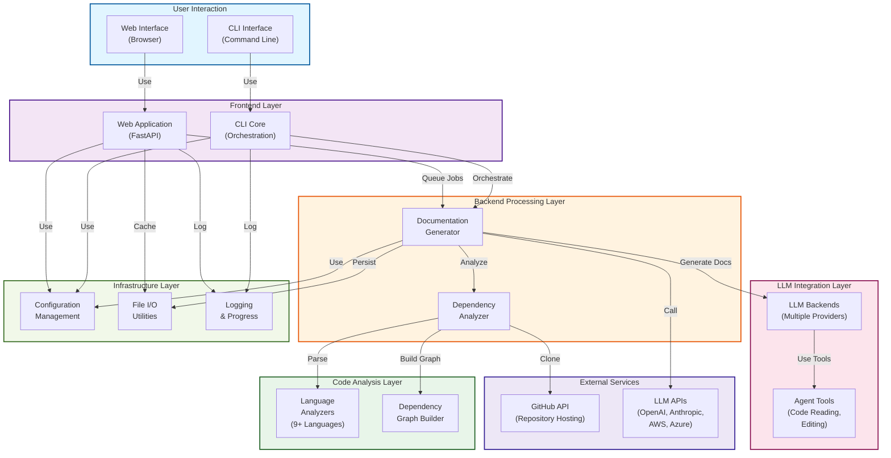
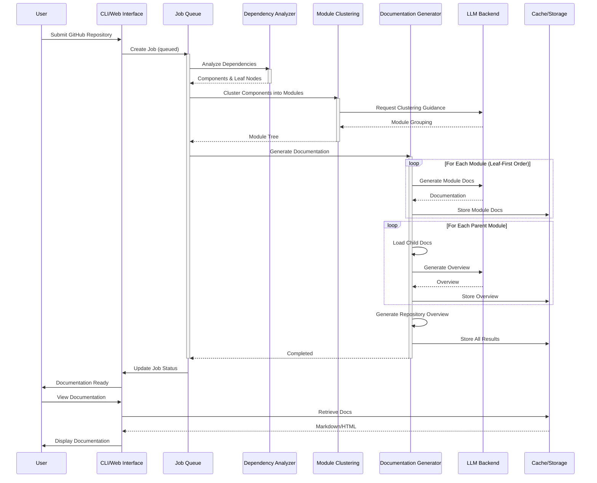
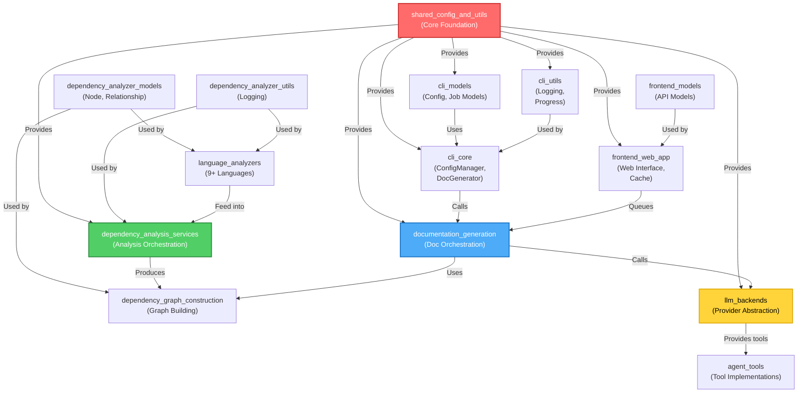

# CodeWiki Repository Overview

## Purpose

**CodeWiki** is an intelligent, AI-powered documentation generation system that automatically analyzes GitHub repositories and generates comprehensive, hierarchical documentation using Large Language Models (LLMs). It bridges the gap between raw source code and organized, human-readable documentation by combining multi-language static analysis with LLM-based semantic understanding.

### Key Capabilities

- **Multi-Language Support**: Analyzes repositories in 9+ programming languages (Python, JavaScript, TypeScript, Java, Kotlin, C#, C++, C, PHP)
- **Intelligent Clustering**: Automatically groups related code components into logical modules
- **Hierarchical Documentation**: Generates documentation at multiple levels (leaf modules, parent modules, repository overview)
- **Multiple LLM Providers**: Supports OpenAI-compatible, Anthropic, AWS Bedrock, and Azure OpenAI APIs
- **Web Interface**: User-friendly submission and documentation browsing interface
- **Caching System**: Intelligent caching prevents redundant analysis
- **Subscription Support**: Works with official subscription-based CLI tools (claude-code, codex)

---

## End-to-End Architecture

### System Architecture Diagram



### Data Flow Diagram

```mermaid
graph LR
    A["GitHub Repository<br/>(Raw Code)"]
    B["Multi-Language<br/>Analysis<br/>(AST Parsing)"]
    C["Dependency Graph<br/>Construction<br/>(Component Mapping)"]
    D["Module Clustering<br/>(LLM-Based<br/>Grouping)"]
    E["Documentation<br/>Generation<br/>(Per-Module<br/>Agents)"]
    F["Hierarchical<br/>Assembly<br/>(Module -> Parent<br/>-> Overview)"]
    G["Markdown<br/>Documentation<br/>+ HTML Viewer"]
    H["Cache &<br/>Web Display"]
    
    A -->|Parse Code| B
    B -->|Extract Components| C
    C -->|Identify Modules| D
    D -->|Generate Docs| E
    E -->|Aggregate| F
    F -->|Output| G
    G -->|Store| H
    
    style A fill:#e3f2fd,stroke:#1976d2
    style B fill:#f3e5f5,stroke:#7b1fa2
    style C fill:#e8f5e9,stroke:#388e3c
    style D fill:#fff3e0,stroke:#f57c00
    style E fill:#fce4ec,stroke:#c2185b
    style F fill:#f0f4c3,stroke:#827717
    style G fill:#e0f2f1,stroke:#00796b
    style H fill:#ede7f6,stroke:#512da8
```



---

## Core Modules Architecture

### Module Organization

The CodeWiki system is organized into five main architectural layers:

#### 1. **CLI & Frontend Layer** - User Interaction
- **[cli_core.md](cli_core.md)** - Command orchestration and workflow management
- **[cli_models.md](cli_models.md)** - Configuration and job state models
- **[cli_utils.md](cli_utils.md)** - Progress tracking and colored logging
- **[frontend_web_app.md](frontend_web_app.md)** - Web interface and job queue management
- **[frontend_models.md](frontend_models.md)** - API data models

#### 2. **Backend Processing Layer** - Documentation Generation
- **[documentation_generation.md](documentation_generation.md)** - Orchestration of the complete documentation pipeline
  - Coordinates dependency analysis, module clustering, and document generation
  - Implements dynamic programming approach (leaf-first module processing)
  - Manages hierarchical documentation aggregation

#### 3. **Code Analysis Layer** - Dependency Extraction
- **[dependency_analysis_services.md](dependency_analysis_services.md)** - Multi-language analysis orchestration
  - Repository cloning and structure analysis
  - Call graph generation and relationship resolution
  - Cross-language support coordination

- **[language_analyzers.md](language_analyzers.md)** - Language-specific AST parsers
  - Tree-sitter based: C, C++, C#, Java, JavaScript, Kotlin, PHP, TypeScript
  - Python AST analyzer for native Python support
  - Unified Node and CallRelationship extraction

- **[dependency_graph_construction.md](dependency_graph_construction.md)** - Graph building and optimization
  - Dependency parser for component extraction
  - Graph builder with leaf node identification
  - Topological sorting for processing order

- **[dependency_analyzer_models.md](dependency_analyzer_models.md)** - Core data structures
  - Node: Code component representation
  - CallRelationship: Dependency tracking
  - AnalysisResult: Complete analysis output

- **[dependency_analyzer_utils.md](dependency_analyzer_utils.md)** - Cross-cutting utilities
  - Colored logging for enhanced readability
  - Module-specific logging configuration

#### 4. **LLM Integration Layer** - AI-Powered Generation
- **[llm_backends.md](llm_backends.md)** - Pluggable LLM provider abstraction
  - PydanticAIBackend: API-key based providers (OpenAI, Anthropic, Bedrock, Azure)
  - CawBackend: Subscription-based CLI tools (claude-code, codex)
  - Fallback model chains for robustness

- **[agent_tools.md](agent_tools.md)** - Tool implementations for agents
  - Code reading and editing capabilities
  - Dependency context management (CodeWikiDeps)
  - File navigation and window expansion

#### 5. **Infrastructure Layer** - Shared Services
- **[shared_config_and_utils.md](shared_config_and_utils.md)** - Central configuration and file I/O
  - Config: Unified configuration management
  - FileManager: Standardized file operations
  - Multi-provider LLM configuration

---

## Processing Pipeline

### Complete Documentation Generation Flow



### Key Processing Stages

**Stage 1: Dependency Analysis** (40% of processing time)
- Clone repository from GitHub
- Parse source files using language-specific analyzers
- Extract components (classes, functions, interfaces, etc.)
- Build call graph showing component relationships
- Identify leaf nodes (entry points for documentation)

**Stage 2: Module Clustering** (20% of processing time)
- Use LLM to intelligently group related components
- Create hierarchical module structure
- Generate module tree showing parent-child relationships
- Cache module tree for future reference

**Stage 3: Documentation Generation** (30% of processing time)
- Process modules in dependency order (leaf-first)
- For each leaf module: Generate comprehensive documentation via agent
- For each parent module: Aggregate children docs and synthesize overview
- Generate repository-level architecture overview

**Stage 4: HTML Generation** (5% of processing time)
- Load generated markdown and metadata
- Create interactive documentation viewer
- Package for GitHub Pages deployment

**Stage 5: Finalization** (5% of processing time)
- Create metadata file with generation info
- Cache all results for future submissions
- Update job status and persist results

---

## Integration Points & Data Models

### Module Dependencies Graph



---

## Key Features & Capabilities

### Multi-Language Support

Supports analysis and documentation generation for:

| Language | Parser | Status |
|----------|--------|--------|
| Python | Native AST | ✅ Stable |
| JavaScript | Tree-Sitter | ✅ Stable |
| TypeScript | Tree-Sitter | ✅ Stable |
| Java | Tree-Sitter | ✅ Stable |
| Kotlin | Tree-Sitter | ✅ Stable |
| C# | Tree-Sitter | ✅ Stable |
| C | Tree-Sitter | ✅ Stable |
| C++ | Tree-Sitter | ✅ Stable |
| PHP | Tree-Sitter | ✅ Stable |

### Multiple LLM Provider Support

- **OpenAI-Compatible** (default): OpenAI, custom endpoints
- **Anthropic**: Direct API integration via litellm
- **AWS Bedrock**: Anthropic models via AWS
- **Azure OpenAI**: Enterprise deployments
- **Subscription Mode**: Official claude-code and codex CLIs (no API key required)

### Intelligent Caching

- Repository documentation cached for 365 days
- Cache indexed by URL hash for O(1) lookups
- Automatic expiry and cleanup
- Prevents redundant analysis of same repositories

### Hierarchical Documentation

- **Leaf Module Docs**: Detailed component-level documentation
- **Parent Module Docs**: Synthesized overview of child modules
- **Repository Overview**: System-wide architecture documentation
- **Dynamic Assembly**: Parent documentation built from children

---

## Repository Statistics

- **Total Modules**: 20+ documented modules
- **Languages Supported**: 9+ programming languages
- **LLM Providers**: 5 major provider integrations
- **Code Base**: Python-first architecture with FastAPI web interface
- **Testing Approach**: Integration tests with real repositories

---

## Getting Started

### CLI Usage

```bash
# Configure API credentials
codewiki config set --api-key sk-xxx --base-url https://api.example.com

# Generate documentation for a repository
codewiki generate --repo /path/to/repo --output ./docs

# Optional: Create documentation branch and commit
codewiki generate --repo /path/to/repo --create-branch
```

### Web Interface

```bash
# Start the web server
python -m codewiki.src.fe

# Access at http://localhost:8000
# Submit repositories via the web form
# View generated documentation in browser
```

---

## Related Documentation

For detailed information about each module, see the comprehensive module documentation:

- **[cli_core.md](cli_core.md)** - CLI orchestration and workflow
- **[cli_models.md](cli_models.md)** - Configuration and job models
- **[cli_utils.md](cli_utils.md)** - Progress tracking and logging
- **[frontend_web_app.md](frontend_web_app.md)** - Web application interface
- **[frontend_models.md](frontend_models.md)** - API data models
- **[documentation_generation.md](documentation_generation.md)** - Doc generation pipeline
- **[dependency_analysis_services.md](dependency_analysis_services.md)** - Code analysis orchestration
- **[language_analyzers.md](language_analyzers.md)** - Language-specific parsers
- **[dependency_graph_construction.md](dependency_graph_construction.md)** - Dependency graph building
- **[dependency_analyzer_models.md](dependency_analyzer_models.md)** - Data models
- **[dependency_analyzer_utils.md](dependency_analyzer_utils.md)** - Utilities
- **[llm_backends.md](llm_backends.md)** - LLM provider integration
- **[agent_tools.md](agent_tools.md)** - Agent tool implementations
- **[shared_config_and_utils.md](shared_config_and_utils.md)** - Shared infrastructure

---

## Summary

CodeWiki is a sophisticated, modular system that combines:

1. **Multi-language static analysis** for understanding code structure
2. **Intelligent module clustering** for logical organization
3. **LLM-powered documentation generation** for semantic understanding
4. **Hierarchical assembly** for complete documentation artifacts
5. **Flexible deployment** (CLI and web interface)
6. **Smart caching** to avoid redundant processing

The architecture emphasizes **separation of concerns**, **provider flexibility**, and **extensibility**, making it suitable for documenting repositories of any size and complexity in multiple programming languages.