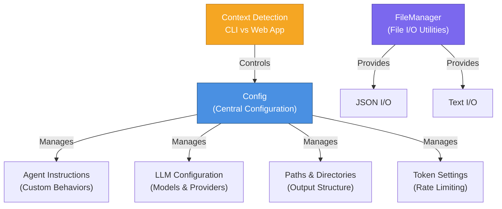
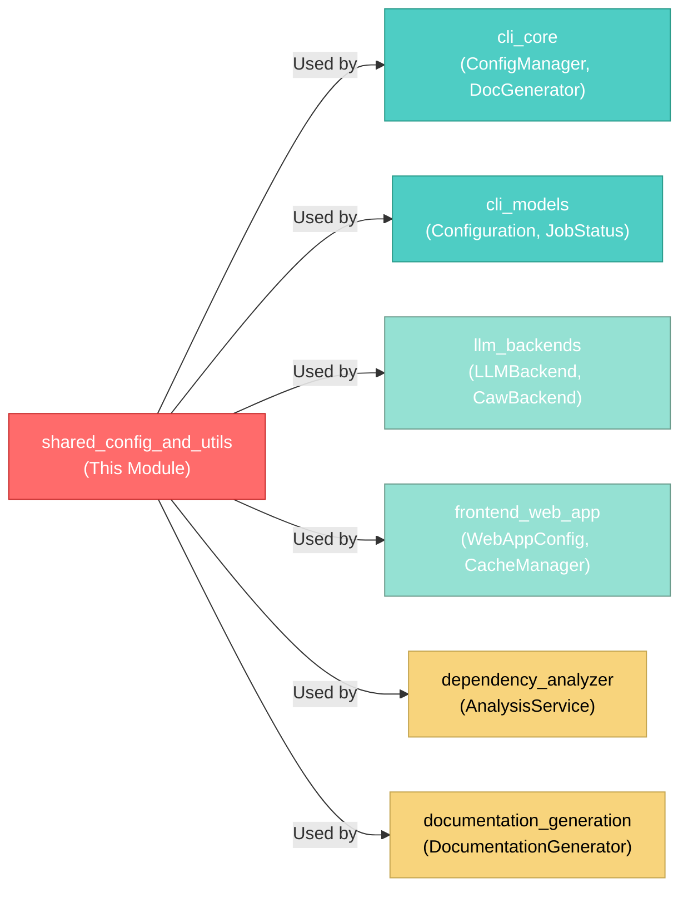
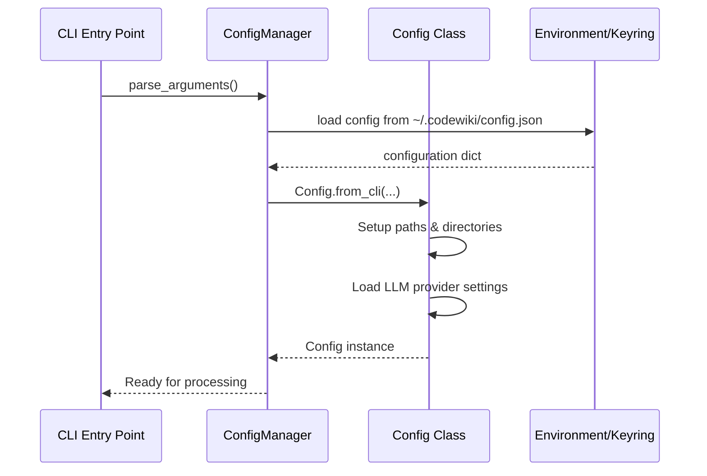
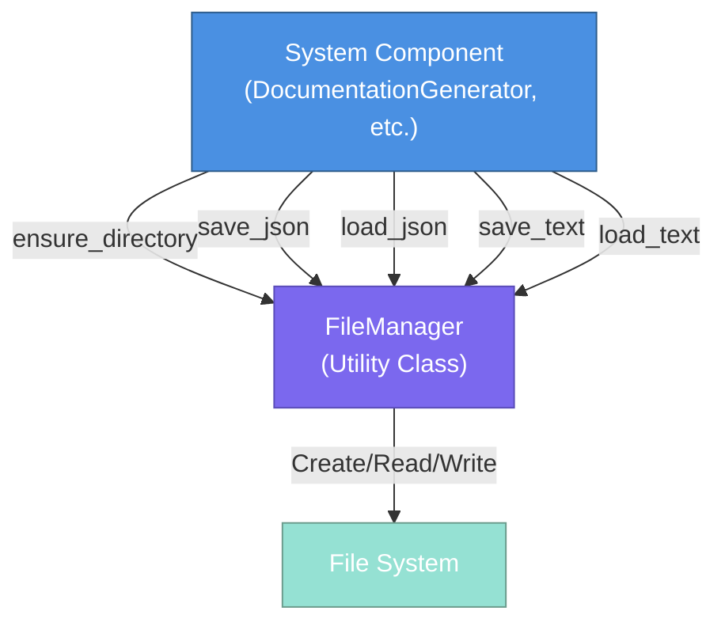
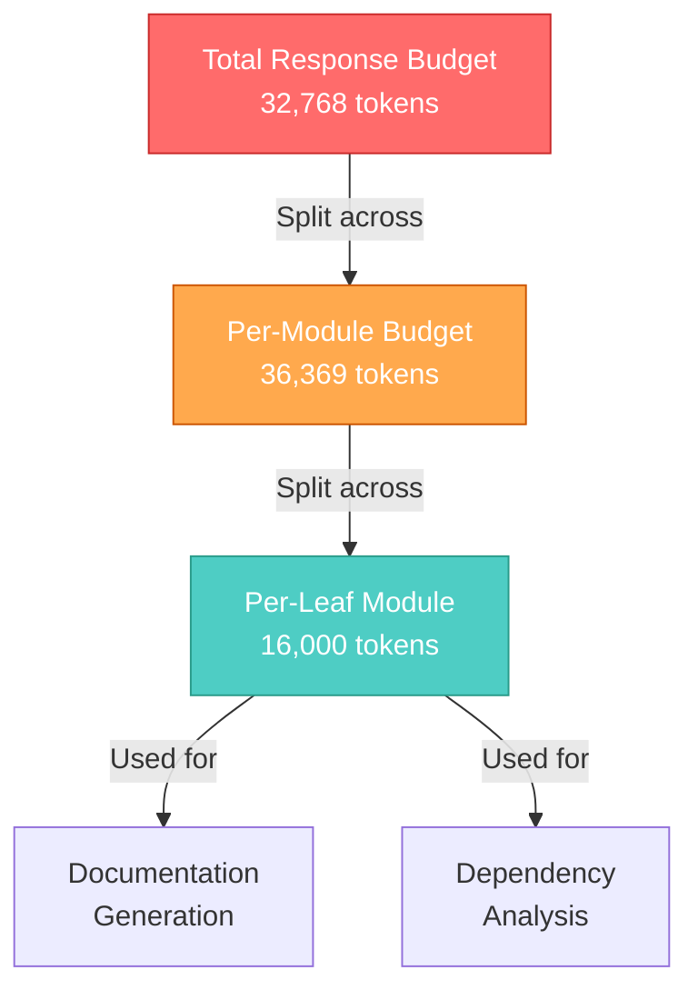
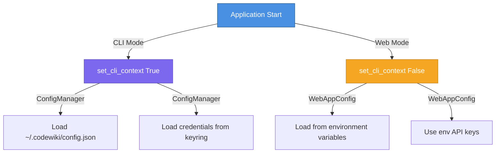

# Shared Config and Utils Module Documentation

## Module Overview

The **Shared Config and Utils** module is the foundational layer of CodeWiki that provides centralized configuration management and cross-cutting file I/O utilities. It serves as a critical backbone for the entire system, enabling consistent configuration handling across CLI, backend services, and frontend web applications.

### Purpose

This module addresses three core responsibilities:
1. **Centralized Configuration Management**: Unified configuration object used throughout the system
2. **Context Detection**: Distinguish between CLI and web application execution contexts
3. **File I/O Operations**: Standardized file handling for JSON and text persistence

### Key Characteristics
- **Framework-Agnostic**: Works seamlessly with both CLI and web applications
- **Provider-Flexible**: Supports multiple LLM providers (OpenAI-compatible, Anthropic, AWS Bedrock, Azure OpenAI)
- **Extensible**: Agent instructions allow runtime customization of behavior
- **Type-Safe**: Uses Python dataclasses for robust configuration schema

---

## Architecture Overview



### Module Dependencies



---

## Core Components

### 1. Config Class

The `Config` class serves as the central configuration object for the entire CodeWiki system. It encapsulates all runtime configuration parameters and provides type-safe access to settings.

#### Class Structure

```python
@dataclass
class Config:
    """Configuration class for CodeWiki."""
```

#### Core Attributes

**Paths & Directories**
```python
repo_path: str                  # Source repository path
output_dir: str                 # Base output directory
dependency_graph_dir: str       # Dependency graph storage
docs_dir: str                   # Documentation output directory
```

**LLM Configuration**
```python
llm_base_url: str              # API endpoint URL
llm_api_key: str               # Authentication key
main_model: str                # Primary model (default: claude-sonnet-4)
cluster_model: str             # Model for clustering operations
fallback_model: str            # Backup model (default: glm-4p5)
provider: str                  # Provider type: openai-compatible, anthropic, bedrock, azure-openai
```

**Provider-Specific Settings**
```python
aws_region: str                # AWS region for Bedrock (default: us-east-1)
api_version: str               # Azure OpenAI API version (default: 2024-12-01-preview)
azure_deployment: str          # Azure OpenAI deployment name
```

**Token Management**
```python
max_tokens: int                # Max response tokens (default: 32,768)
max_token_per_module: int      # Per-module limit (default: 36,369)
max_token_per_leaf_module: int # Leaf module limit (default: 16,000)
```

**Customization**
```python
max_depth: int                 # Hierarchical decomposition depth
agent_instructions: Optional[Dict[str, Any]]  # Custom behavior directives
```

#### Properties

The Config class provides convenient properties for accessing agent instructions:

```python
@property
def include_patterns(self) -> Optional[List[str]]:
    """Get file include patterns from agent instructions."""
    
@property
def exclude_patterns(self) -> Optional[List[str]]:
    """Get file exclude patterns from agent instructions."""
    
@property
def focus_modules(self) -> Optional[List[str]]:
    """Get focus modules from agent instructions."""
    
@property
def doc_type(self) -> Optional[str]:
    """Get documentation type from agent instructions."""
    # Values: 'api', 'architecture', 'user-guide', 'developer'
    
@property
def custom_instructions(self) -> Optional[str]:
    """Get custom instructions from agent instructions."""
```

#### Factory Methods

**1. from_args() - CLI Argument Parsing**
```python
@classmethod
def from_args(cls, args: argparse.Namespace) -> 'Config':
    """Create configuration from parsed CLI arguments."""
```
Creates a Config instance with default values derived from CLI argument parsing. Sanitizes repository name for use in directory structures.

**2. from_cli() - Explicit Parameter Construction**
```python
@classmethod
def from_cli(
    cls,
    repo_path: str,
    output_dir: str,
    llm_base_url: str,
    llm_api_key: str,
    main_model: str,
    cluster_model: str,
    fallback_model: str = FALLBACK_MODEL_1,
    provider: str = "openai-compatible",
    aws_region: str = "us-east-1",
    api_version: str = "2024-12-01-preview",
    azure_deployment: str = "",
    max_tokens: int = DEFAULT_MAX_TOKENS,
    max_token_per_module: int = DEFAULT_MAX_TOKEN_PER_MODULE,
    max_token_per_leaf_module: int = DEFAULT_MAX_TOKEN_PER_LEAF_MODULE,
    max_depth: int = MAX_DEPTH,
    agent_instructions: Optional[Dict[str, Any]] = None
) -> 'Config':
    """Create configuration for CLI context with explicit parameters."""
```
Provides full control over all configuration parameters with sensible defaults. Used when configuration is loaded from configuration files.

#### Methods

**get_prompt_addition()**
```python
def get_prompt_addition(self) -> str:
    """Generate prompt additions based on agent instructions."""
```
Builds dynamic prompt modifications based on configuration settings. Returns a formatted string with:
- Documentation type guidance (API, architecture, user-guide, developer)
- Focus module emphasis
- Custom instructions

**Usage Example:**
```python
config = Config.from_cli(...)
if config.agent_instructions:
    prompt += config.get_prompt_addition()
```

#### Context Detection System

Two global functions manage execution context:

```python
def set_cli_context(enabled: bool = True):
    """Set whether we're running in CLI context (vs web app)."""
    global _CLI_CONTEXT
    _CLI_CONTEXT = enabled

def is_cli_context() -> bool:
    """Check if running in CLI context."""
    return _CLI_CONTEXT
```

**Purpose**: Allows different behaviors based on execution environment:
- **CLI Context**: Load credentials from keyring, use local config files
- **Web Context**: Use environment variables for sensitive data

#### Default Constants

```python
OUTPUT_BASE_DIR = 'output'                           # Root output directory
DEPENDENCY_GRAPHS_DIR = 'dependency_graphs'          # Dependency graph storage
DOCS_DIR = 'docs'                                    # Documentation directory
MAX_DEPTH = 2                                        # Module hierarchy depth

# Token limits
DEFAULT_MAX_TOKENS = 32_768                          # Total response tokens
DEFAULT_MAX_TOKEN_PER_MODULE = 36_369                # Per-module budget
DEFAULT_MAX_TOKEN_PER_LEAF_MODULE = 16_000           # Leaf-module budget

# LLM Models (loaded from environment or defaults)
MAIN_MODEL = 'claude-sonnet-4'
FALLBACK_MODEL_1 = 'glm-4p5'
CLUSTER_MODEL = MAIN_MODEL
```

### 2. FileManager Class

The `FileManager` class provides a simple, standardized interface for file I/O operations. It abstracts low-level file handling and ensures consistent error handling across the system.

#### Class Structure

```python
class FileManager:
    """Handles file I/O operations."""
```

All methods are static, making FileManager a utility class that doesn't require instantiation.

#### Methods

**Directory Operations**
```python
@staticmethod
def ensure_directory(path: str) -> None:
    """Create directory if it doesn't exist."""
    os.makedirs(path, exist_ok=True)
```
Creates nested directory structures with proper error handling. Safe to call multiple times on the same path.

**JSON Operations**
```python
@staticmethod
def save_json(data: Any, filepath: str) -> None:
    """Save data as JSON to file with 4-space indentation."""
    
@staticmethod
def load_json(filepath: str) -> Optional[Dict[str, Any]]:
    """Load JSON from file, return None if file doesn't exist."""
```
Handles JSON serialization/deserialization with graceful fallback for missing files. Data is saved with 4-space indentation for readability.

**Text Operations**
```python
@staticmethod
def save_text(content: str, filepath: str) -> None:
    """Save text content to file."""
    
@staticmethod
def load_text(filepath: str) -> str:
    """Load text content from file."""
```
Simple UTF-8 text file operations. `load_text()` raises an exception if the file doesn't exist (unlike `load_json()`).

#### Singleton Instance

```python
file_manager = FileManager()
```

A module-level instance is provided for convenient access across the codebase:
```python
from codewiki.src.utils import file_manager

file_manager.ensure_directory('./output')
file_manager.save_json(data, './output/data.json')
```

---

## Data Flow

### Configuration Initialization Flow



### File I/O Usage Pattern



---

## Integration Points

### 1. CLI Core (ConfigManager)

The `ConfigManager` reads configuration from:
- Command-line arguments
- `~/.codewiki/config.json` file
- System environment variables
- Keyring for credentials

It then creates a `Config` instance for use throughout the CLI application.

**Reference**: See [cli_core.md](cli_core.md) for detailed integration.

### 2. LLM Backends

All LLM backend implementations ([llm_backends.md](llm_backends.md)) use Config settings:
- `llm_base_url` and `llm_api_key` for API connections
- `provider` type for endpoint selection
- `main_model`, `fallback_model` for model selection
- Token limits for response generation

```python
# Example from backend implementation
def __init__(self, config: Config):
    self.base_url = config.llm_base_url
    self.api_key = config.llm_api_key
    self.provider = config.provider
    self.main_model = config.main_model
```

### 3. Documentation Generation

The `DocumentationGenerator` ([documentation_generation.md](documentation_generation.md)) uses:
- `max_tokens` for LLM prompts
- `max_token_per_module` for hierarchical budgeting
- `agent_instructions` for custom behavior
- `output_dir` and `docs_dir` for file output
- `FileManager` for persistent storage

### 4. Frontend Web App

The frontend ([frontend_web_app.md](frontend_web_app.md)) uses:
- `WebAppConfig` derived from environment variables
- `FileManager` for caching and data persistence
- Different context (web vs CLI) for credential handling

---

## Usage Examples

### Example 1: Creating Configuration in CLI

```python
from codewiki.src.config import Config, set_cli_context

# Mark that we're in CLI context
set_cli_context(True)

# Create config with explicit parameters
config = Config.from_cli(
    repo_path="/path/to/repo",
    output_dir="/path/to/output",
    llm_base_url="https://api.anthropic.com/v1",
    llm_api_key="sk-xxxx",
    main_model="claude-opus",
    cluster_model="claude-opus",
    provider="anthropic",
    agent_instructions={
        'doc_type': 'architecture',
        'focus_modules': ['auth', 'database'],
        'custom_instructions': 'Emphasize security aspects'
    }
)

# Access configuration properties
print(config.main_model)           # claude-opus
print(config.doc_type)              # architecture
print(config.get_prompt_addition()) # Dynamic prompt additions
```

### Example 2: File Operations

```python
from codewiki.src.utils import file_manager

# Create output directory structure
file_manager.ensure_directory('./output/docs')
file_manager.ensure_directory('./output/dependency_graphs')

# Save analysis results
analysis_results = {
    'modules': ['auth', 'database', 'api'],
    'total_dependencies': 45,
    'complexity_score': 8.2
}
file_manager.save_json(analysis_results, './output/analysis.json')

# Save documentation
doc_content = "# Architecture Documentation\n..."
file_manager.save_text(doc_content, './output/docs/architecture.md')

# Load data back
loaded_results = file_manager.load_json('./output/analysis.json')
doc = file_manager.load_text('./output/docs/architecture.md')
```

### Example 3: Using Agent Instructions

```python
config = Config.from_cli(
    repo_path="/repo",
    output_dir="/output",
    llm_base_url="...",
    llm_api_key="...",
    main_model="claude-opus",
    cluster_model="claude-opus",
    agent_instructions={
        'include_patterns': ['src/**/*.py', 'lib/**/*.ts'],
        'exclude_patterns': ['**/test/**', '**/node_modules/**'],
        'focus_modules': ['auth', 'payment'],
        'doc_type': 'api',
        'custom_instructions': 'Include code examples for all endpoints'
    }
)

# Check if specific filters are configured
if config.include_patterns:
    # Apply file inclusion filters
    files = apply_patterns(repo, config.include_patterns, config.exclude_patterns)

# Build documentation with custom guidance
prompt = f"""
Generate comprehensive documentation for the following modules:

{', '.join(config.focus_modules)}

{config.get_prompt_addition()}
"""
```

### Example 4: Configuration for Different LLM Providers

```python
# OpenAI Compatible API
config_openai = Config.from_cli(
    repo_path="/repo",
    output_dir="/output",
    llm_base_url="http://localhost:8000/v1",
    llm_api_key="sk-xxxx",
    main_model="gpt-4",
    cluster_model="gpt-3.5-turbo",
    provider="openai-compatible"
)

# AWS Bedrock
config_bedrock = Config.from_cli(
    repo_path="/repo",
    output_dir="/output",
    llm_base_url="https://bedrock-runtime.us-west-2.amazonaws.com",
    llm_api_key="aws_credentials",
    main_model="anthropic.claude-3-sonnet-20240229-v1:0",
    cluster_model="anthropic.claude-3-haiku-20240307-v1:0",
    provider="bedrock",
    aws_region="us-west-2"
)

# Azure OpenAI
config_azure = Config.from_cli(
    repo_path="/repo",
    output_dir="/output",
    llm_base_url="https://myresource.openai.azure.com",
    llm_api_key="azure_api_key",
    main_model="gpt-4-turbo",
    cluster_model="gpt-35-turbo",
    provider="azure-openai",
    api_version="2024-12-01-preview",
    azure_deployment="my-deployment"
)
```

---

## Token Management Strategy

The module implements a hierarchical token budgeting system to control LLM costs and prevent runaway token consumption:



**Hierarchy Levels:**
1. **Max Tokens**: Overall response limit per LLM call
2. **Per-Module Budget**: Tokens allocated to documenting a single module
3. **Per-Leaf Budget**: Tokens allocated to leaf modules (smaller allocations)

This ensures:
- No single operation exceeds reasonable token limits
- Larger modules get more budget for comprehensive documentation
- Smaller modules are efficiently documented without excess
- System remains cost-effective

---

## Context Detection System

The module provides context awareness for different execution environments:



**Benefits:**
- **CLI**: Secure credential storage in system keyring
- **Web**: Simple environment variable configuration
- **Flexibility**: Same code works in both contexts with different configuration sources

---

## Environment Variables

The Config class loads default values from environment variables:

| Variable | Default | Purpose |
|----------|---------|---------|
| `MAIN_MODEL` | `claude-sonnet-4` | Primary LLM model |
| `FALLBACK_MODEL_1` | `glm-4p5` | Fallback LLM model |
| `CLUSTER_MODEL` | `MAIN_MODEL` | Model for clustering operations |
| `LLM_BASE_URL` | `http://0.0.0.0:4000/` | LLM API endpoint |
| `LLM_API_KEY` | `sk-1234` | API authentication key |

**Note**: These defaults are suitable for development. Production deployments must override via environment variables or configuration files.

---

## Error Handling & Edge Cases

### FileManager

**Missing Files**
```python
# load_json() returns None for missing files (graceful)
data = file_manager.load_json('./nonexistent.json')
assert data is None

# load_text() raises FileNotFoundError
content = file_manager.load_text('./nonexistent.txt')  # Raises FileNotFoundError
```

**Directory Creation**
```python
# Safe to call multiple times
file_manager.ensure_directory('./output')
file_manager.ensure_directory('./output')  # No error
```

### Config

**Missing Agent Instructions**
```python
config = Config.from_cli(..., agent_instructions=None)
print(config.doc_type)  # Returns None
print(config.get_prompt_addition())  # Returns empty string
```

**Empty Agent Instructions**
```python
config = Config.from_cli(..., agent_instructions={})
print(config.focus_modules)  # Returns None
```

---

## Related Modules

- **[cli_core.md](cli_core.md)**: ConfigManager integration
- **[cli_models.md](cli_models.md)**: Configuration model definitions
- **[llm_backends.md](llm_backends.md)**: LLM provider integration
- **[documentation_generation.md](documentation_generation.md)**: Uses Config for generation settings
- **[frontend_web_app.md](frontend_web_app.md)**: Web context configuration

---

## Summary

The **Shared Config and Utils** module provides:

✅ **Centralized Configuration**: Single source of truth for all system settings
✅ **Multiple LLM Providers**: Support for OpenAI, Anthropic, AWS Bedrock, Azure OpenAI
✅ **Flexible Customization**: Agent instructions enable runtime behavior customization
✅ **Token Management**: Hierarchical budgeting prevents runaway costs
✅ **Context Awareness**: Seamlessly works in CLI and web app contexts
✅ **File I/O Utilities**: Standardized file operations across the system
✅ **Type Safety**: Dataclass-based configuration prevents errors

This foundational module enables the rest of CodeWiki to operate with consistent, flexible, and manageable configuration.
